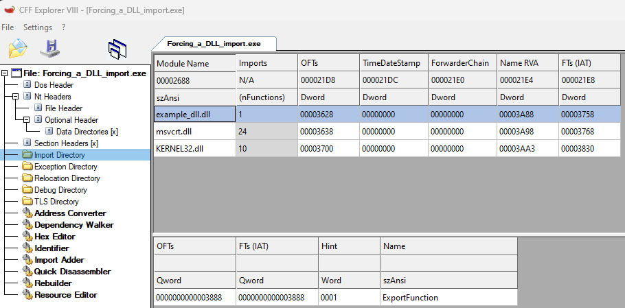

To make the file look more legitimate, you can try statically importing any DLLs into your binary file.

For example:




Compile your own Dll:

```c title="example_dll.c"
#include <stdio.h>
#include <windows.h>


#define DLL_EXPORT __declspec(dllexport)

DLL_EXPORT void ExportFunction(){
    MessageBoxA(NULL, "EXPORT", "EXPORT", MB_OK);
}


void NotExportFunction(){
    MessageBoxA(NULL, "NOT EXPORT", "NOT EXPORT", MB_OK);
}


BOOL WINAPI DllMain(
    HINSTANCE hinstDLL,  // handle to DLL module
    DWORD fdwReason,     // reason for calling function
    LPVOID lpvReserved )  // reserved
{
    // Perform actions based on the reason for calling.
    switch( fdwReason ) 
    { 
        case DLL_PROCESS_ATTACH:
         // Initialize once for each new process.
         // Return FALSE to fail DLL load.
            break;

        case DLL_THREAD_ATTACH:
         // Do thread-specific initialization.
            break;

        case DLL_THREAD_DETACH:
         // Do thread-specific cleanup.
            break;

        case DLL_PROCESS_DETACH:
        
            if (lpvReserved != NULL)
            {
                break; // do not do cleanup if process termination scenario
            }
            
         // Perform any necessary cleanup.
            break;
    }
    return TRUE;  // Successful DLL_PROCESS_ATTACH.
}


// clang example_dll.c -shared -s -o example_dll.dll
```

Create your ```.def``` file to choose the function to export
Here, I choose the function named ```ExportFunction```

```batch title="example_dll.def"
LIBRARY example_dll.dll
EXPORTS
    ExportFunction
```

Compile your ```def``` file with ```dlltool``` command

```batch
dlltool -d example_dll.def -l example_dll.dll.a -D example_dll.dll
```


Now you can compile your binary with the imported function from the DLL

```c title="Forcing_a_DLL_import.c"
#include <windows.h>
#include <stdio.h>

// ExportFunction

__declspec(dllimport) void ExportFunction();   // Reference to exported function
static void* force_load = (void*)ExportFunction;

int main() {
    ExportFunction();
    return 0;
}

// clang Forcing_a_DLL_import.c -o Forcing_a_DLL_import.exe -L. -lexample_dll
```


