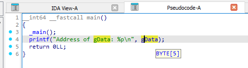
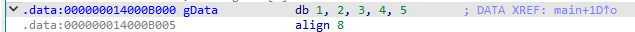
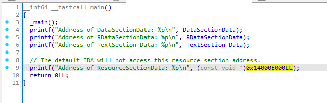

By default, if you define your data like this:

```C++ title="data_section.c"

// This data will be stored in .data section
#include <stdio.h>
#include <windows.h>

BYTE gData[] = {
    0x1, 0x2, 0x3, 0x4, 0x5
};

int main(){
    printf("Address of gData: %p\n", gData);
    return 0;
}

// clang data_section.c -g -o data_section.exe
// -g for debug

```

Then this data will be visible clearly in IDA.



This data will be stored in .data section



You can manually choose the section where the data will be stored by adding some prefix:

```C++ title="data_in_section.c"
#include <stdio.h>
#include <windows.h>

// This data will be stored in .data section
BYTE DataSectionData[] = {
    0x1, 0x2, 0x3, 0x4, 0x5
};

// This data will be stored in .rdata section (read-only)
const BYTE RDataSectionData[] = {
    0x6, 0x7, 0x8, 0x9, 0x10
};

// This data will be stored in .text section
#define TEXT_SECTION __attribute__((section(".text"))) 
BYTE TextSection_Data[] TEXT_SECTION = {
    0xA, 0xB, 0xC, 0xD, 0xE, 0xF
};

// This data will be stored in .rsrc section
#define RESOURCE_SECTION __attribute__((section(".rsrc")))
const unsigned char ResourceSectionData[] RESOURCE_SECTION = {
    0xDE, 0xAD, 0xBE, 0xEF // Your raw data here
};

int main(){
    printf("Address of DataSectionData: %p\n", DataSectionData);
    printf("Address of RDataSectionData: %p\n", RDataSectionData);
    printf("Address of TextSection_Data: %p\n", TextSection_Data);
    printf("Address of ResourceSectionData: %p\n", ResourceSectionData);
    return 0;
}

// -g for debug
// clang src\data_in_section.c -g -o binary\data_in_section.exe
```

Result:




Also, ```ResourceHacker``` won't display the data either.

