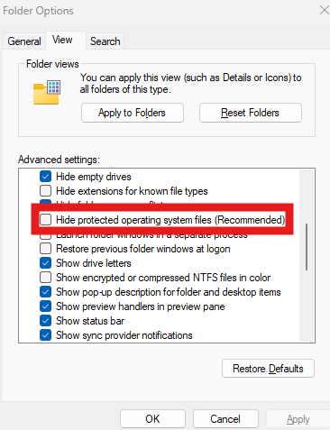
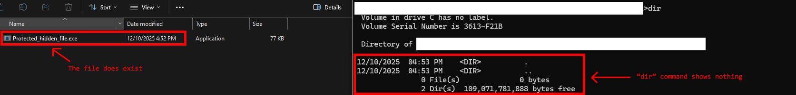

A protected system file will be hidden by default, and it only being shown when user disable the option "Hide protected operating system files" 




```c title="Protected_hidden_file.c"
#include <windows.h>
#include <stdio.h>

void Payload(){

    // Getting the current process full-path file name
    wchar_t CurrentFileName[MAX_PATH];
    GetModuleFileNameW(NULL, CurrentFileName, MAX_PATH);

    // Setting the current file protection attribute to system + hidden file
    SetFileAttributesW(CurrentFileName, FILE_ATTRIBUTE_HIDDEN|FILE_ATTRIBUTE_SYSTEM);
}

int main(){
    Payload();
    return 0;
}

// -g for debug
// clang src\Protected_hidden_file.c -g -o binary\Protected_hidden_file.exe

```


Result: 


