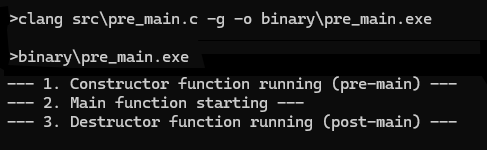
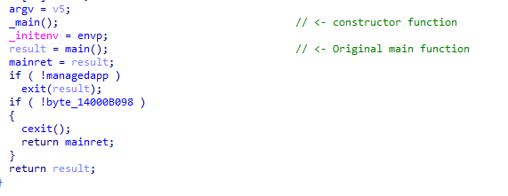
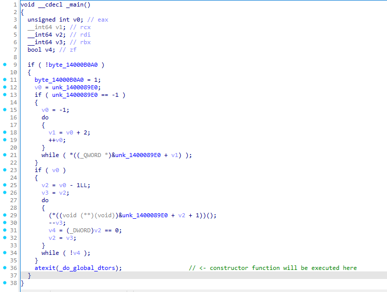

You can define a ```constructor``` function to execute pre-main and after-main

```c title="pre-main.c"
#include <stdio.h>

// This function will be called automatically before main() executes
#define PRE_MAIN __attribute__((constructor))
PRE_MAIN void pre_main_constructor() {
    printf("--- 1. Constructor function running (pre-main) ---\n");
    // Place your initialization code here (e.g., setting up global data)
}

int main() {
    printf("--- 2. Main function starting ---\n");
    return 0;
}

// Optional: You can also define a destructor function to run after main()
#define POST_MAIN __attribute__((destructor))
POST_MAIN void post_main_destructor() {
    printf("--- 3. Destructor function running (post-main) ---\n");
}

// clang src/pre-main.c -g -o binary/pre-main.exe
```





Try looking at decompiled windows




