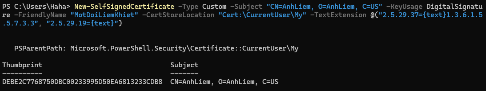
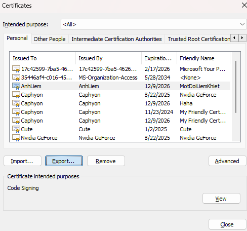
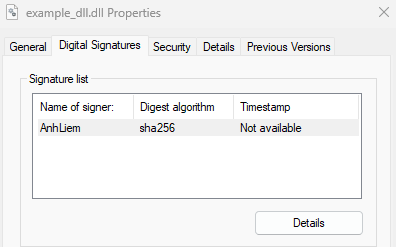

Generate your certificate:

```powershell
New-SelfSignedCertificate -Type Custom -Subject "CN=[CERT_NAME], O=[CERT_NAME], C=US" -KeyUsage DigitalSignature -FriendlyName "[CERT_FRIENDLY_NAME]" -CertStoreLocation "Cert:\CurrentUser\My" -TextExtension @("2.5.29.37={text}1.3.6.1.5.5.7.3.3", "2.5.29.19={text}")
# Replace [] fields
```

Ex: 



Use ```certmgr.exe``` to export your certificate




After exporting, you can sign you application using this certificate file (```signtool.exe```)


```cmd
signtool sign /a /f [cert path].pfx /p [password] /td sha256 /fd sha256 [YOUR_BINARY]
```


Result:

